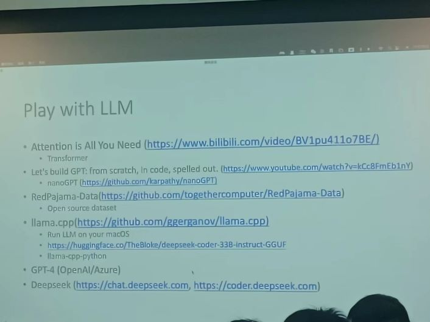

#### Large Language Model & High Perforam Calculation

大模型的训练离不开高性能计算

训练过程：先**pre-train**一个base model，再**fine tune**一个aligned model，用于**inference**

训练优化：

- 三维并行化 粒度从粗到细，可以一起做

  - DP 数据并行

    - 简单的数据分发训练，但是需要做同步。

      每个mini batch并行计算完之后需要同步各个optimizer的状态，这就导致每个**节点需要存储所有的参数**

    - 现在用ZeRO-DP，将优化器的**状态**进行分割，通过即时通讯索取数据，让自己只需要存储自己这一块的内容

  - PP 流水线并行

    - 把线性的计算任务拆分到不同的device=>也可以省内存
    - 把流水线拆得更细

  - TP Tensor并行

    - 数学上等价的矩阵拆分计算=>也可以省内存

- Kernel(算子)优化

NCCL提供了一个通信框架库，有描述这些通信的通信原语

NVLink Bridge & NVSwitch：主机内的多GPU高速通信网络

然后NV也提了一个多主机互联的硬件组织架构，用200GPS光纤链接

目前实践上支持主机内高速互联，然后每个GPU配一个网卡，通过PCIE传输数据

- 每个网卡接到不同的交换机(网络平面)——资源均摊

- 网络平面：

  - 例子：两层胖树，每个树干交换机可以连64个leaf，每个leaf可以连32个树干，32个网卡端口

    -> 最多只能连2048(64*32)个GPU【？】，如果要扩展，可能就要多层。因此用多个网络平面来节省资源，同时由于一个GPU连了8个平面，因此平面和平面之间的数据对GPU来说都是可达的

LLM 33B 64G 256GPUS token1k/s

关于可靠性

- 时间扰动的影响，当机子数目增加，被扰动的概率是很高的，例如GC,timer等，这会导致并行时间的下降
- 硬件故障……
- 快速恢复：checkpoint的**异步**保存、checkpoint的载入、高速存储

推理优化：最新工作VLLM，数学等价拆分

