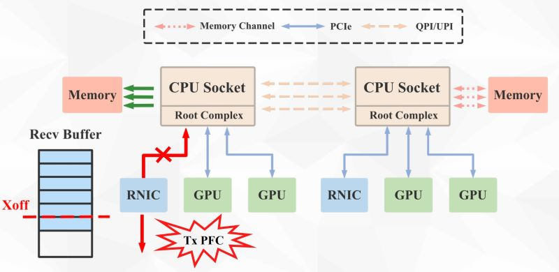
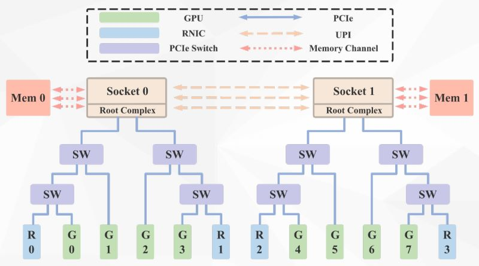

### Hostping：Diagnosing Intra-host Network Bottlenecks in RDMA Servers

NSDI23 [论文原文](https://www.usenix.org/system/files/nsdi23-liu-kefei.pdf) [slides](https://www.usenix.org/system/files/nsdi23_slides_liu-kefei.pdf)

CPU和CPU之间通过特定协议(Intel-UPI/AMD)在通道间通信

memory channel: 指CPU暴露给内存的接口的通道数(非内存内通道数)

网卡和CPU通信通过PCIe链路进行，由于CPU的PCIe接口数有限，因此通过PCIe Switch之类的设备帮助多个外设复用同一个PCIe接口(可能还会再连一个PCIe Hub更低一级)

主机内部网络的瓶颈：无损模式下由于线路老化可能突然RNIC的线路degrade了，此时由于buffer被快速挤满，因此RNIC网卡会回返Tx PFC告诉下面上面已经满了。——可能带来PFC storm或者PFC deadlock

如果不是无损模式则可能有包的drop

GDR：GPU Direct RDMA，GPU直接访问其他机器上GPU的显存

本文讨论的机器内部结构，这里Socket可以理解为CPU

硬件设备和设备不能直接通过Switch互联，还是得先去CPU走Access Control Service

本篇motivation：RNIC的带宽增长太快，PCIe4.0带宽速率支持不上了，同时PICe拓展的各个独特设备的复杂拓扑也导致可能的故障问题

因此设计这个Hostping用来帮助辨认这些问题，比如不知道是主机的问题还是网络的问题等等

- 主机空闲(负载<5%)，测试硬件的延迟和带宽
- 主机繁忙时，如果RNIC寄存器有异常，那么测量网络

测出每个RNIC到硬件的metrics(带宽)后，得出一个metrics矩阵，然后本文中的问题都可以从这个矩阵中看出pattern

对比baseline标记出正常链路，从而推断拓扑下的异常链路【正常的链路中每段都是正常的，剩余的难以分辨的可以标记为异常】

但是有时异常是由于链路问题，有时可能是因为错误配置【Root Complex控制器】导致，这里通过时延来区分二者

如果很多RNIC到memory有问题，那么可能是memory channel有问题

Disscussion: 可能还是idea比较好，说服力、开销、metric的选取等还有待商榷
