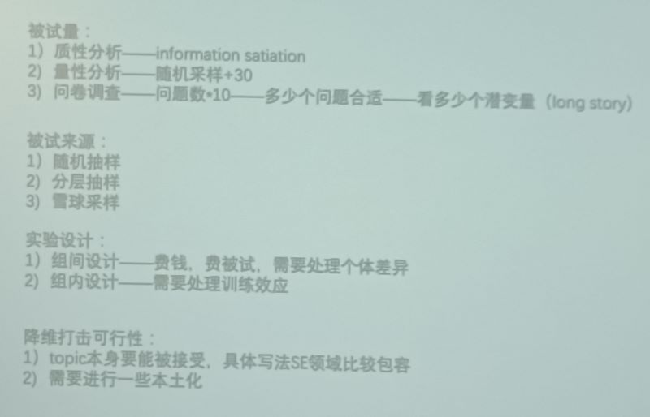

#### **Do Users Write More Insecure Code with AI Assistants?** CCS23

Empirical Study，心理学

- AI assistant是否会写更多unsafe code——会，因为AI模型训练数据很多就unsafe
- 用户是否信任？——用户会信任这些代码
- 如何构造prompt和迭代prompt

做对照实验，5道算法题找人做，有/无AI

统计上显著性检验要求的solid的被试数：问题数*10

分层：相同性质的一层，逐层采

雪球：先找到一个，然后从这个为抓手顺着这个找其他相同性质的

组内设计：同一个组的人在不同的条件下做同一套测试(但是可以加入随机)

#### AppAgent: Multimodal Agents as Smartphone Users. arXiv 2023

大模型的Agent能做的事有限，理解能力不够

基于DOM tree标注页面可以点击的元素，一一标号

用户操作/解释给Agent，然后它存储下来

