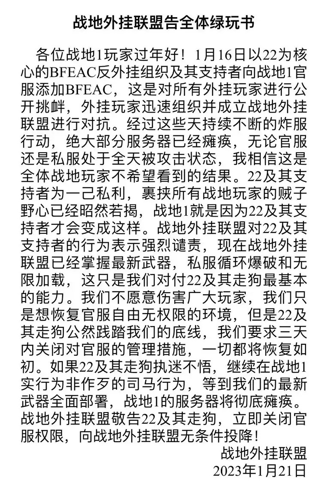
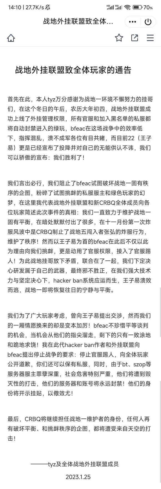
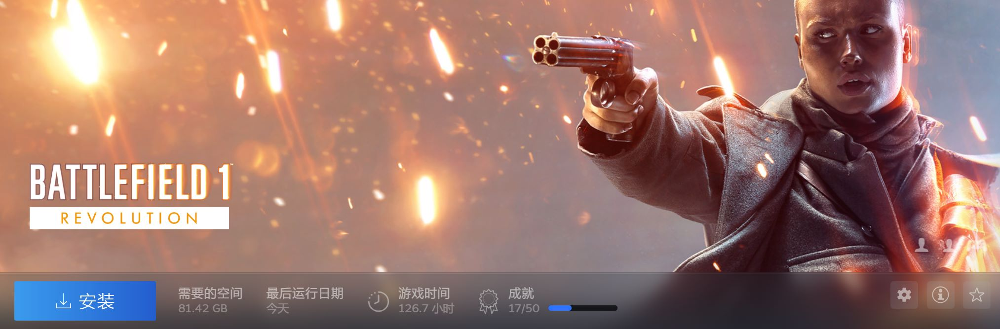
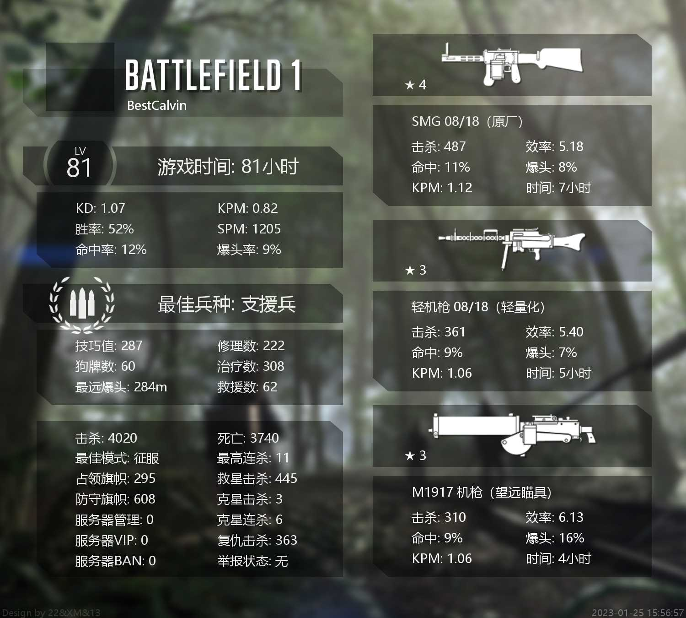
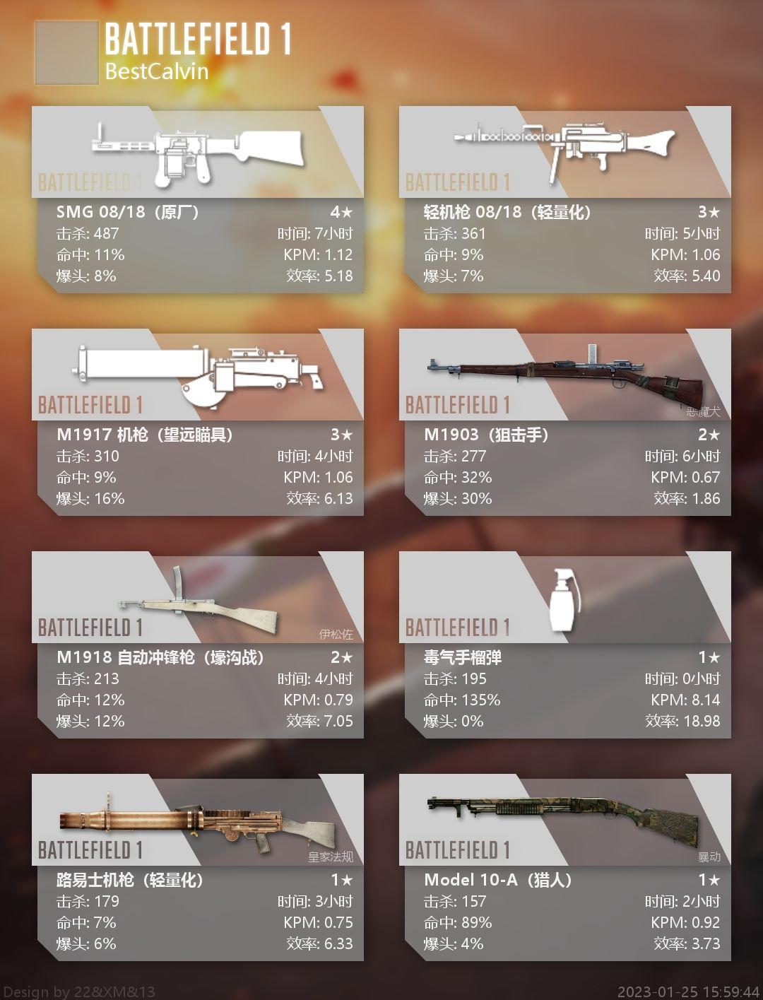

事发当晚EA出面修复了漏洞，亚服起死回生，只能说是虚惊一场，不过这块墓碑还是保留着吧……

战地1寿终正寝了，就在这里为这个游戏立个墓碑吧。

大概事件顺序：

- BF1开发商EA疏于对游戏环境的整治，导致玩家间形成外挂在官服捞薯，绿色玩家在私服玩的微妙平衡
- 反外挂组织BFEAC中成员`22`发现了EA漏洞，能够获取官服管理员权限，于2023年1月16日将EAC工具(可联ban外挂黑名单)挂载到BF1官服上，打破了平衡
- 外挂组织在2023年除夕前后进行DDOS攻击，使得大量私服服务器无限重开，难以进行游戏
- DDOS攻击开销大，难以为继，2023年1月22日后攻击频率降低
- 俄罗斯人`shinku5_1`同样发现了该漏洞(一说拿到了更高的EA官方管理权限)，于2023年1月25日对官服和私服同时进行攻击，永久封禁正常玩家账号等
- 在双方“核弹互射”之后，游戏正式进入“核冬天”，亚服在线人数不足200人
- 玩家中出现一部分投降主义行为，可以合理推测`22`遭受一定程度的网暴
- 贴吧等平台出现大量反对外挂声援`22`的帖子，steam出现针对EA的大量差评

一些图片留存：

**墓碑**

> [战争结束了！你们都可以回家了！](https://tieba.baidu.com/p/8232793039)
>
> 战争结束了，英勇的战士们。在这场持久战中，你们奋力抵抗，永不妥协，不惧牺牲，无愧于勇士之名，钢铁之誉。然而，人事已尽，天命难违。你们每个人都已经尽到了自己应尽的责任，而现在，我们已经付出了太多的牺牲，太多的疲劳，我们已经无法再继续坚持战斗下去了。这不怪你们。放下枪去吧，去拥抱自己的亲人吧，去与朋友们到饭店小酌一杯吧，去在温暖阳光下呼吸新鲜的，不带战争阴霾空气吧。因为这些宝贵的事物，不就是我们拼死奋战所想守护的吗？现在，听好了，各位士兵们，最终的命令是：你们都可以回家了！
> 这场能完结所有战争的战争，终将分出胜负，枪炮都会腐蚀，绿草会再次生长，届时所有战争的痕迹将不复存在，这块土地会自己慢慢痊愈，像其他的伤痛一样，到时我们肯定已经入土长眠。
> 但是！
> 从帕斯尚尔的泥泞，
> 到武普库夫的冰雪，
> 由凡尔登的烈焰，
> 到苏瓦松的平原，
> 从西奈的沙漠，
> 到亚眠的废墟，
> 由圣康坦的战壕，
> 到阿尔登的雨林，
> 从黑戈兰湾的巨浪，
> 到法乌克斯的廊道，
> 从流血宴厅的城堡，
> 到格拉巴山的蓝天！
> 见证着我们的战斗，我们的牺牲，我们的守望！
> 士兵们，向你们自己敬礼！
> 我们麻木不仁，我们天真无邪。我们是可敬的英雄，也是十恶不赦的罪犯。我们注定成为传奇，也注定在历史中消逝。我们是天空的骑士、沙漠中的鬼魂、泥土中打滚的鼠辈。这些就是我们的故事！

R.I.P.