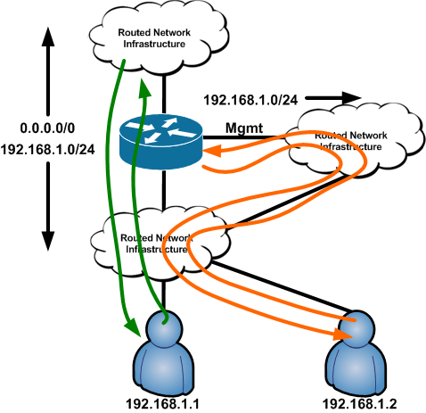
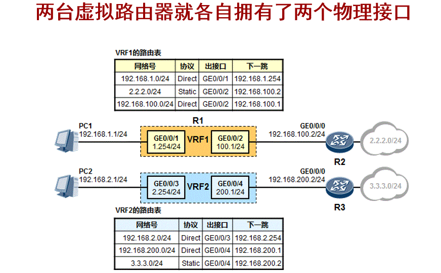
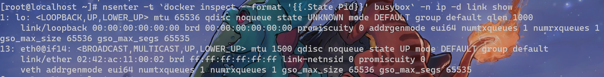
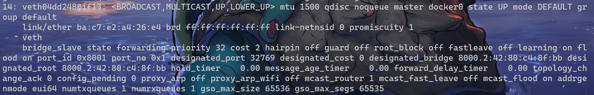
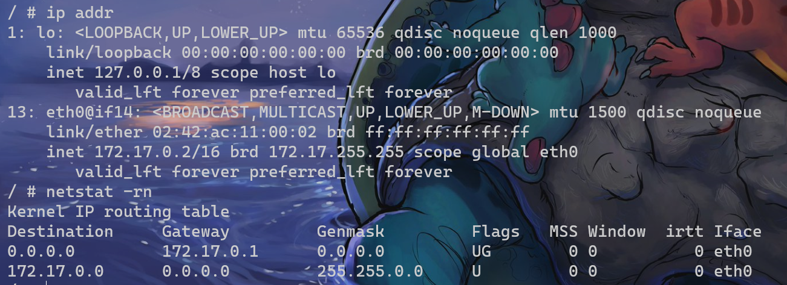

### Docker网络虚拟化

参考资料：

- [An introduction to network namespaces](https://www.dasblinkenlichten.com/an-introduction-to-network-namespaces/)
- [五分钟理解VRF](https://blog.csdn.net/Kangyucheng/article/details/88051969)
- Cloud Native Data Center Networking, Chapter 7: Container Networking

#### VRF(Virtual Route Forwarding)

在一个路由器中构建多份虚拟的路由表，从而实现路由/转发虚拟化。

所谓的虚拟路由表，可以理解为将一组接口->接口的转发策略打包到一起，当请求到来时，自然可以通过映射找到要去的接口。

这样做可以实现目的地相同但下一条不同的两个转发策略同时存在于一个路由器中。



例如该图中192.168.1.1和192.168.1.1同属于192.168.1.0/24，此时路由器处理来自两个不同接口的请求时(分别路由到数据接口和管理接口)，如果没有VRF，回去的包必定走同一个接口，会造成**不对称路由问题**(来去的链路不一样)。使用VRF后，可以让来自下方云接口的请求去下方云，来自右边云接口的请求回右边云。

一个具体的路由表例子：



同时，为了一定程度上实现资源共享，VRF之间实现部分“互通”也是有必要的，即设立一个转发路径让数据包被转发至另一个VRF所辖的接口，这被称为**route leaking**

#### Linux Network Namespace

> Network namespace允许你在Linux中创建相互隔离的网络视图，每个网络名字空间都有自己独立的网络配置，包括：网络设备、路由表、IPTables规则，路由表、网络协议栈等。新建的网络名字空间与主机默认网络名字空间之间是隔离的。我们平时默认操作的是主机的默认网络名字空间。

VRF常见的部署场景是为两个接口(**数据接口**和**管理接口**)分别配置一套路由表。因此对于一台服务器来说，也可以通过namespace来做到与VRF相同的事情：只需要将不同的接口【网卡】添加到不同的namespace下就可以了。由此，来自相同ip段的请求发送到不同的接口上就可以用不同的链路响应，而不是用非对称的方式(用唯一接口对应一个ip段)解决。

另外，对于VRF语境下"route leaking"的需要，Linux提供了`veth`这样一种虚拟设备来连通不同的namespace。`veth`在构建时可以理解为一个类似Linux管道的设备，在一个接口处写，另一个接口就能读出相应的数据，格式一般为`a@b`，因此可以从本namespace中把数据递到其他namespace中。

#### Bridge

veth可以解决让两个namespace通信的问题，而bridge则可以让多个namespace之间进行通信。例如构建n个veth，然后将n个出发接口加入对应namespace，将n个目的接口都加入bridge。那么就实现了多个namespace的互通。

#### Single-host下Docker的Linux实践

Docker容器使用了LinuxNetwork Namepsace，并在宿主机上创建了docker0的bridge。在未指定网络配置时，通过docker run启动的容器都会有一个veth连到docker0。因此默认情况下，各个容器是互通的。

> ```shell
> docker run -idt --name=busybox busybox #后台启动一个busybox的容器
> nsenter -t `docker inspect --format '{{.State.Pid}}' busybox` -n ip -d link show #进入该容器namespace并查看链路层相关接口
> ```
>
> 
>
> 可以看到此时容器中除了有loopback接口之外，还有一个ifindex(interface index)为13的`veth`设备接口，该设备从eth0指向if14。这里eth0是namespace中为了虚拟化而起的别名。
>
> 回到主namespace，执行`ip -d link show`
>
> 
>
> 可以看到主namespace下if14正是一条前往if13的veth，并且该接口正属于docker0的bridge。

Docker会将默认的子网172.17.0.0/16应用于docker0，同时对于新产生的容器，在为容器分配该子网下的ip的同时，也为容器加上去docker0的路由。

> 进入容器后查看ip和路由
>
> 

docker0则使用NAT代理所有的内部请求至Docker拥有的与宿主机处于同一网段的single-host的ip，从而实现内外部的通信。


上述是在single-host上docker使用bridge的一种实现，multihost场景下，有更多的插件可以供选择。对于k8s来说，其网络配置力求做到没有NAT参与，即容器IP在内外看来都是一致的，这部分在本文中不再深入讨论。
