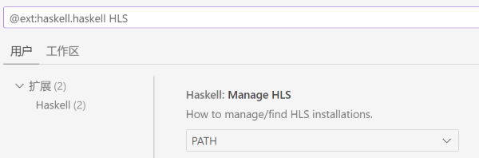
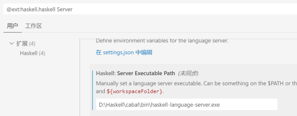

操作系统：Win11

参考资料：

- [windows配置Haskell+VSCode开发环境（2022.8）_ghcup 镜像_SevenBerry的博客-CSDN博客](https://blog.csdn.net/SevenBerry/article/details/126467318)
- [GHCup 源使用帮助 — USTC Mirror Help 文档](https://mirrors.ustc.edu.cn/help/ghcup.html)

我们使用GHCup这样一个工具来帮助我们安装Haskell工具链，由于默认下载源在境外网站，因此国内用户需要使用镜像站来加快下载的速度。

首先在Windows powershell终端中执行

```powershell
$env:BOOTSTRAP_HASKELL_YAML = 'https://mirrors.ustc.edu.cn/ghcup/ghcup-metadata/ghcup-0.0.7.yaml'
Set-ExecutionPolicy Bypass -Scope Process -Force;[System.Net.ServicePointManager]::SecurityProtocol = [System.Net.ServicePointManager]::SecurityProtocol -bor 3072;Invoke-Command -ScriptBlock ([ScriptBlock]::Create((Invoke-WebRequest https://mirrors.ustc.edu.cn/ghcup/sh/bootstrap-haskell.ps1 -UseBasicParsing))) -ArgumentList $true
```

输入希望安装的目录并回车，全部选择默认配置。

由于Windows缺少编译工具等，GHCup会先下载msys2这样一个工具包。该工具包同样默认从境外源下载，因此可以使用VPN等工具加速下载，例如**在Clash中**打开一个ps终端执行上述命令。

msys2下载完之后按Ctrl+C终止命令，此时关闭代理，重新打开ps窗口执行上述命令。GHCup会自动下载cabal等工具，当**cabal安装完**后，终端会卡在`Downloading the latest package list from hackage.haskell.org`这一行，再次终止命令。

在Haskell安装目录下的cabal文件夹内找到`config`文件，将其中

```
repository hackage.haskell.org
  url: http://hackage.haskell.org/
  -- secure: True
  -- root-keys:
  -- keys-threshold: 3
```

替换为科大源

```
repository mirrors.ustc.edu.cn
  url: https://mirrors.ustc.edu.cn/hackage/
  secure: True
```

然后执行

```shell
cabal update
```

可以看到终端显示`Downloading the latest package list from mirrors.ustc.edu.cn`，等待其将package list下载完。

使用cabal安装`HLS`，构建出的可执行文件应该在`cabal/bin`下

```
cabal install haskell-language-server
```

安装完成后，在VSCode中安装`Haskell`插件。为Haskell插件添加HLS的配置项即可。






另：此方法安装的cabal可能版本较老，install新版本依赖时可能在build环境出错，可以使用ghcup install cabal ${version}指定安装新版本cabal，并依旧使用上述方法替换cabal的config。
