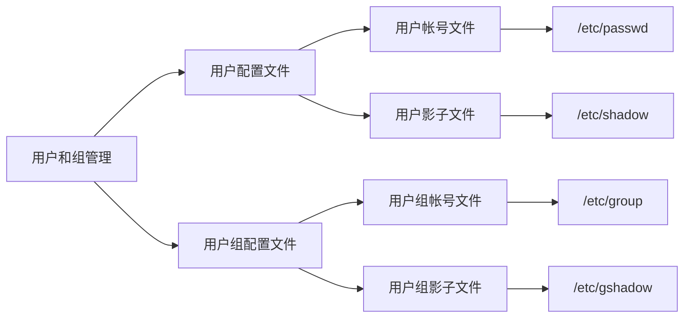

### 用户和组管理

Linux用户分为以下三类

- 超级用户【root】
- 系统用户【内建用户，不能用来登录，方便系统进程控制资源】
- 普通用户

Linux用户组分为以下三类

- 私有组【建立新帐户时与账户名同名的组】
- 标准组【组中可以容纳多个用户】
- 系统组【由Linux系统建立】




```shell
# /etc/passwd
root:x:0:0:root:/root:/bin/bash
daemon:x:1:1:daemon:/usr/sbin:/usr/sbin/nologin
bin:x:2:2:bin:/bin:/usr/sbin/nologin
sys:x:3:3:sys:/dev:/usr/sbin/nologin
sync:x:4:65534:sync:/bin:/bin/sync
# ...
calvin:x:1000:1001::/home/calvin:/bin/sh
```

用户名 : 密码(x表示存放在shadow) : **uid** : **gid** : 注释 : 主目录(有权限的目录) : 登陆后使用的默认shell

真正起到**区分用户**作用的是**uid**，0为root管理员，1\~999为系统账号，1000\~60000为一般账号

`/etc/shadow`中则记录了加密过后的密码和一些诸如修改时间，有效期等配置信息

### 文件权限控制

使用`ls -h xxx`可以查看文件信息

```shell
# ls -l db.json
-rwxrwxrwx 1 root root 292602 Nov 24 13:39 db.json
```

这里第一段是权限信息。

第一个字符代表文件类型

- \- 代表普通文件
- d 代表目录文件
- s 代表套接字文件
- p 代表管道文件
- c 代表字符文件
- b 代表块文件
- l 代表链接文件

后面每三个字符为一组，分别代表owner/group/others的权限

- r 读

- w 写

- x 对文件执行/对目录搜索

- s setuid或setguid【只在owner和group项可设置】

  > ```shell
  > # ls -l /bin/passwd
  > -rwsr-xr-x 1 root root 68208 Jul 15  2021 /bin/passwd
  > ```

- t 对目录文件设置后，只有目录内文件的所有者才能更改文件【只在others项可设置】

可以使用`chmod`进行权限更改，例如777就对应rwxrwxrwx，而755则对应rwxr-xr-x。如果要设定owner的s位需要在前面加上4，group的s位加2，others的t位加1。例如1755对应rwxrwxrwt

### 进程权限控制

- euid：effective uid
- ruid：real uid【真实的uid】
- ssuid：saved set uid【拷贝自euid，便于控制子进程等uid】

set uid实际设置的就是euid，类似的，也能设置gid。

我们可以看一下完整的执行passwd的过程

- `fork`出一个子进程，此时uid和gid都是real的
- passwd对于others允许执行，因此进程可以调用`exec`执行passwd文件
- passwd有s权限位，此时进程euid被设为root的uid，即0
- 进程可以修改shadow文件

### 参考内容

- [Linux权限原理详解](https://www.lxlinux.net/2315.html)
- [Linux——/etc/passwd文件（管理用户和组）](https://blog.csdn.net/hutongkoudemihu/article/details/125462312)
