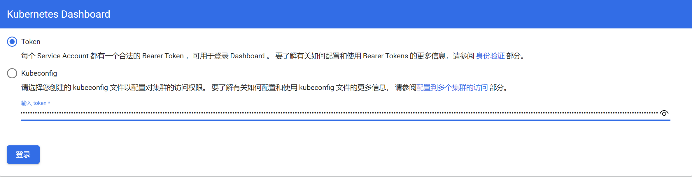
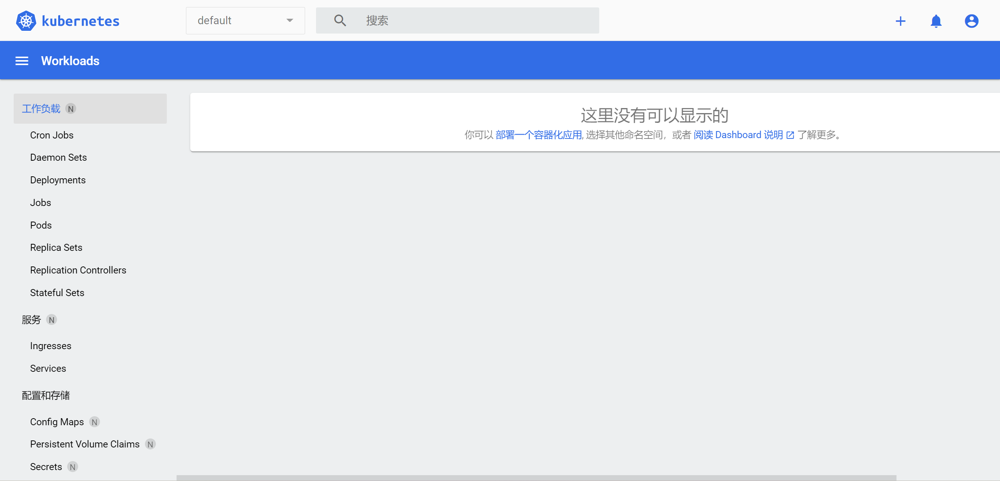

使用工具：[kubeasz](https://github.com/easzlab/kubeasz)

### 单节点集群部署

参考：[快速指南](https://github.com/easzlab/kubeasz/blob/master/docs/setup/quickStart.md)

```shell
export release=3.3.1
wget https://github.com/easzlab/kubeasz/releases/download/${release}/ezdown
chmod +x ./ezdown

./ezdown -D #下载镜像等文件
./ezdown -S #容器化运行kubeasz

docker exec -it kubeasz ezctl start-aio #使用默认配置安装aio集群
```

```shell
kubectl get svc -A #查看所有服务，如果出现kubectl: command not found的报错可以重新登录使环境变量生效
```

```shell
#删除集群
docker exec -it kubeasz ezctl destroy default
```

注意：

- 单节点的集群在虚拟机挂起或关机重启时进程会挂掉，导致无法再控制kubectl等，可以重新安装aio集群，并按照报错提示删除原来的文件

### 多节点集群部署

参考：[一键安装Kubernetes？使用kubeasz带你10分钟装好一个k8s集群，不受国内网络环境影响](https://zhuanlan.zhihu.com/p/562533111)

在**每台机器上**进行如下操作配置ssh免密登录，安装kubeasz

```shell
cd  ~/.ssh #如果没有该文件夹，可以ssh自己一下
ssh-keygen -t rsa
ssh-copy-id ${ip1} #这里的ip是你希望免密登录的机器ip，根据提示输入目标机器的密码
ssh-copy-id ${ip2}
... #请将包括自己在内的所有机器的ip都执行一遍

export release=3.3.1
wget https://github.com/easzlab/kubeasz/releases/download/${release}/ezdown
chmod +x ./ezdown

./ezdown -D #下载镜像等文件
./ezdown -S #容器化运行kubeasz
```

在某台机器上执行

```shell
docker exec -it kubeasz ezctl new k8s-01 #创建新集群k8s-01
vi /etc/kubeasz/clusters/k8s-01/hosts #修改配置文件的如下几项：
#[etcd]为数据库要放在哪些机器上
#[kube_master]为master节点
#[kube_node]为work节点
#CLUSTER_NETWORK可以选用结构简单的flannel
docker exec -it kubeasz ezctl setup k8s-01 all #一键安装
```

安装完成后，运行`source ~/.bashrc`或断开ssh重连使环境变量生效

同样使用`docker exec -it kubeasz ezctl destroy k8s-01`**删除集群**

### 查看dashboard

打印服务信息，根据port拿到端口：

```shell
kubectl get svc -A | grep kubernetes-dashboard
# port 443:30255/TCP
```

打印token等信息：

```shell
kubectl describe -n kube-system secrets admin-user
```

访问https://\${NodeIP}:\${NodePort}【Chrome可能会禁止访问，可以使用其他浏览器】，输入对应token即可






