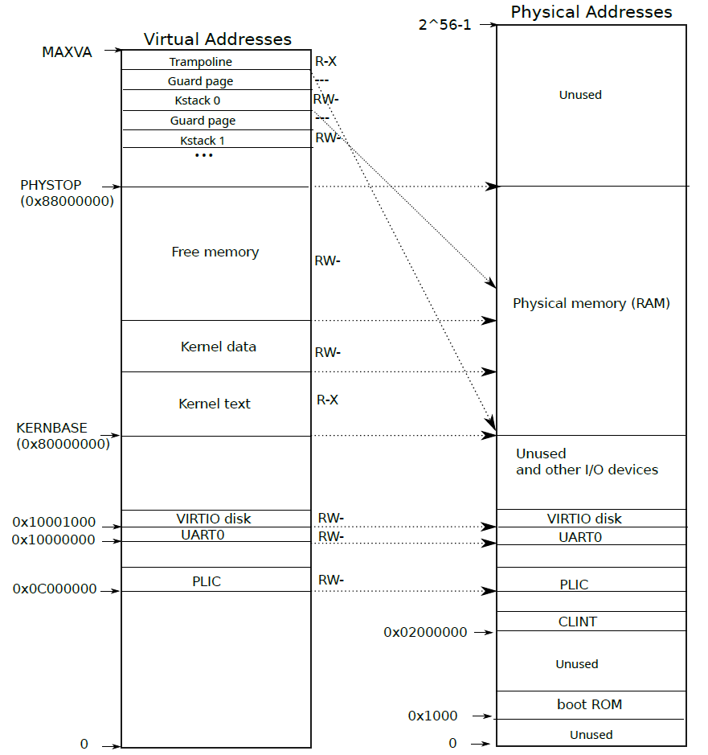
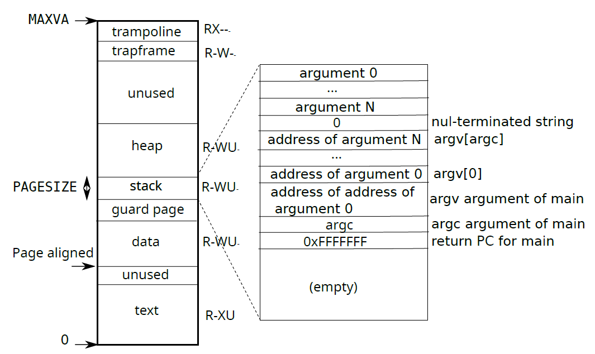

### 实验环境

- Virtual Box 6.1
- Ubuntu 22.04
- MIT6.828 2022

### Lab1：Xv6 and Unix utilities

文档链接：[Lab: Xv6 and Unix utilities (mit.edu)](https://pdos.csail.mit.edu/6.828/2022/labs/util.html)

#### sleep

本练习要求读完xv6第一章

> - 为什么要用fork+exec而不是将二者合并？
>
>   这样做提供了一个重定向文件描述符而不扰乱原进程的机会。fork和exec都不会修改文件描述符表，如果做成原子化的，那么若要修改子进程的fd，势必需要在原进程做修改和还原。
>
>   例如在shell中执行cat < in.txt时，先fork，然后解析cmd，然后输入重定向，然后exec
>
> - Pipe的好处？
>
>   - 自清理
>  - 任意长内容传输
>   - 两个进程并发执行

按照提示写就行，这里的sleep是系统调用，具体的调用原理我暂时还不清楚，应该是一个生成好的入口直接渠道kernel的sleep了

#### pingpong

参考xv6书中给出的pipe使用样例

```c
int fd[2];
pipe(fd); //fd[0]用于read，fd[1]用于write
```

我在parent里写了一个wait(&pid)，防止出现对管道的争用

然后按照描述parent先写然后等待子进程结束，子进程先读后写最后退出，然后parent读取后退出

#### primes

这道题难度稍微有点高，具体要做的在[this page](http://swtch.com/~rsc/thread/)中已经给出。简单来说需要主进程往管道里塞2~...的数字，之后每个子进程读取并打印第一个数a，建立一个管道，然后派生出一个和自己操作相同的子进程。前一个子进程将能够整除a的数字筛掉，并将剩余数字写到管道中交由后一个子进程处理。

当管道的写端被关闭时，进程read的返回值是0，我在这里卡了一段时间。

这是出错的代码：

```c
if((pid = fork()) == 0) {
    prime(fd_);
}
else{
    while(read(fd[0], &temp, 4)) {
        if(temp % num != 0) {
            write(fd_[1], &temp, 4);
        }
    }
    close(fd_[1]);
    wait(&pid);
    close(fd_[0]);
}
```

这里我错误地认为父进程单方面close父子进程就不会再有东西打开文件，但是实际上fork时子进程也会继承父进程的文件描述符表，所以要父子进程都关掉fd[1]，子进程read的返回值才会是0。

正确写法如下：

```c
if((pid = fork()) == 0) {
    close(fd_[1]);
    prime(fd_);
}
else{
    close(fd_[0]);
    while(read(fd[0], &temp, 4)) {
        if(temp % num != 0) {
            write(fd_[1], &temp, 4);
        }
    }
    close(fd_[1]);
    wait(&pid);
}
```

另外本体递归和fork的概念也容易把人搞迷糊，用return还是exit，这都是需要考虑的问题。

#### find

本题可以参考ls的写法，了解怎么遍历文件夹以及判断文件类型，然后用递归写就可以了。

#### xargs

实现方式不难，while循环里用gets读入一行，如果发现长度为0那么就break，否则手动从buf中找出arg们，然后调用fork以及exec。这里xargs的argv[1]是命令名，到新的argv中要挪到argv[0]去，后面的刚好依次前移。


### Lab2：system calls

文档链接：

本次lab要求读完xv6第二章

> - RISCV拥有三种模式：`machine mode`, `supervisor mode`和`user mode`，CPU从machine mode开始，执行一些命令后转到supervisor mode，在该mode下，我们称系统运行在内核态。RISCV提供`ecall`指令使代码进入supervisor mode，然后对syscall指令进行检查

#### Using gdb

make qemu-gdb后会在项目根目录下生成`.gdbinit`文件，lab文档要求重新开一个窗口运行gdb。实测可用的命令为：

```shell
gdb-multiarch -iex "set auto-load safe-path /"
```

`gdb-multiarch`用于支持`.gdbinit`中的riscv架构，`auto-load`用于让gdb自动加载根目录下的`.gdbinit`文件

可以使用如下命令使以后只需要使用safegdb即可

```shell
cat >> ~/.bashrc
alias safegdb="gdb-multiarch -iex \"set auto-load safe-path /\""
```

>  gdb的layout src指令会使终端会一分为二，可以使用Ctrl+X, A来关闭layout

xv6执行流程：

- 系统启动后以`machine mode`执行`kernel/entry.S`，它设定一些特权寄存器后调用`kernel/start.c`的`start`函数。
- `start`函数设定好`mstatus`以及`mepc`两个寄存器以后开启中断等，然后使用`mret`指令读取前述两个集群器的值，进入`supervisor mode`以及调用`kernel/main.c`的`main`函数。
- `main`函数初始化好一系列东西以后调用`kernel/proc.c`的`scheduler`函数，进行进程调度。第一个用户态进程是`user/initcode.S`，它由前述过程中调用的`kernel/proc.c`的`userinit`函数初始化进程相关信息。
- `initcode.S`通过系统调用执行`exec("/init")`，该程序来自于`user/init.c`，可以打开一个`console`文件，并fork出一个子进程执行`sh`命令

> syscall的执行流程是用户进程设立好对应的寄存器的值后，使用硬件终端指令进行软中断，CPU发现中断后进行mode的切换以及切换程序栈等，实现从用户态到内核态的转变

Q: Looking at the backtrace output, which function called syscall?
A: Function usertrap called function syscall.

Q: What is the value of p->trapframe->a7 and what does that value represent? (Hint: look user/initcode.S, the first user program xv6 starts.)
A: The value of p->trapframe->a7 is 7. `li a7, SYS_exec` in user/initcode.S moves SYS_exec whose value is 7 into register a7.

Q: What was the previous mode that the CPU was in?
A: User mode. `initcode.S` which executes in user mode uses syscall to execute `init`.

Q: Write down the assembly instruction the kernel is panicing at. Which register corresponds to the varialable num?
A: The instruction is "lw a3,0(zero)". Varialable num is stored in a3.

Q: Why does the kernel crash? Hint: look at figure 3-3 in the text; is address 0 mapped in the kernel address space? Is that confirmed by the value in scause above?
A: The kernel crashes because it reads the value of an invalid address 0 which is not mapped in the kernel address space. The value scause is 0xd which means a load page fault occurred referring to chapter 4.1.10 of riscv-privileged-v1.10.

Q: What is the name of the binary that was running when the kernel paniced? What is its process id (pid)?
A: The name of the process is "initcode" and its pid is 1.

#### System call tracing

本题要求实现一个新系统调用trace，它能够规定进程接下来执行哪些系统调用会打印提示信息。

首先按照文档要求修改相关头文件c文件，添加trace函数。文档在下一步提示将tracemask存储进proc结构体中，称为进程信息的一部分，这一做法实在很巧妙。我原先在想是否需要在内核中使用全局变量+映射表等方式来存储，这样看来完全是没有必要的。因此`sys_trace`函数做的就是将它的参数存进进程信息中，之后`syscall`函数就可以根据这个值来判断是否需要打印相关信息。由于结构体的这个值初始化的时候是0，所以不必担心鲁棒性。

之后在fork时将子进程的tracemask设为和父进程一样就可以通过测试啦，如果`trace children`那个样例报超时，可以进gradelib.py中把`run_qemu_kw`的timeout设高一点。

#### Sysinfo

本题要求实现一个新的系统调用sysinfo，该函数需要在参数中的sysinfo结构体中填入空闲的内存数以及系统总进程数。

`sys_sysinfo`函数具体的准备工作与trace类似，主要的工作在于实现`freemem`，`nproc`以及使用`copyout`。`freemem`统计系统中所有可用内存，这里在`kernel/kalloc.c`中可以使用kmem.freelist拿到空闲页的链表，统计空闲页数再乘上每页的大小即可。`nproc`统计所有状态不为UNUSED的进程数目(UNUSED则是类似进程池的概念，一开始初始化了，但是没有使用)，再`kernel/proc.c`中遍历proc数组即可。

`copyout`则用于将数据拷贝到用户态内存，利用`myproc`函数拿到进程的页表等信息后即可将参数填写完毕。

最后还要自己加个time.txt，否则差一份满分。


下面总结一下增加syscall的流程，以`xxx`为例

- `user/user.h`主要用于给用户态进程提供一个可以调用的函数声明`xxx()`，具体的函数定义在`user/usys.pl`生成汇编码中(实际上这些函数就是用ecall指令调用kernel中的系统调用函数桩，和系统调用的实现没有关系)

- `kernel/syscall.h`中定义了不同系统调用的号码`SYS_xxx`，`kernel/syscall.c`中则将`sys_xxx()`放入syscalls数组的对应位置，以及在syscall_names中写入名称xxx

- 然后在以sys开头的c文件中实现`sys_xxx()`，例如`kernel/sysproc.c`等

  > 如果想要在其他文件中写一些工具函数，例如`kernel/kalloc.c`等，可以在`kernel/defs.h`中写好定义，再到具体的文件中去实现

### Lab3：page tables

文档链接：[Lab: page tables (mit.edu)](https://pdos.csail.mit.edu/6.828/2022/labs/pgtbl.html)

本次lab要求读完xv6第三章

> xv6运行的Sv39RISC-V机器中，有效地址为39位，其中页索引27位，页内偏移12位(每页4096字节)。翻译成物理地址时，只需要将页索引更换为44位的物理索引PPN即可。
>
> 如果不做额外处理，一个进程将拥有2^27^个PTE，实在是过于庞大。因此采用多级页表的方式，将27位每9位分成一段，将2^9^=512个PTE，每个PTE占8B(64位)，刚好放进一页。因此，在多级页表中，第一级页表的PTE中PPN存放对应二级页表的页号，之后转到那个物理页查找即可。每个CPU的`satp`寄存器存放根页表的地址，因此可以同时执行不同程序。
>
> | Reserved | PPN  | RSW      | D     | A        | G      | U    | X          | W        | R        | V     |
> | -------- | ---- | -------- | ----- | -------- | ------ | ---- | ---------- | -------- | -------- | ----- |
> | 11位     | 44位 | Reserved | Dirty | Accessed | Global | User | Executable | Writable | Readable | Valid |
>
> 补充：OS负责维护页表，而查找页表获得真实物理地址的工作实际由MMU硬件完成，因此不用担心权限问题。
>
> 
>
> xv6内核虚拟地址空间与物理地址空间的关系：
>
> - KERNBASE到PHYSTOP从物理空间直接映射，这部分由内核自身拥有。
>  - 实际上QEMU只提供这部分物理存储
>   - fork时为子进程分配的空间地址一定在QEMU的物理空间中，也就是在内核视角下一定在这一段，因此内核可以直接使用这个物理地址作为虚拟地址进行内存拷贝等操作
> - PHYSTOP之上的虚拟空间存放内核栈等数据，这部分同样映射到实QEMU的物理空间中
>   - 所以实际上这部分物理空间在内核的虚拟空间被映射了两次
>   - 每一个进程都有一个内核栈，即Kstack..，为了防止溢出产生问题，增加了一个Guard Page，对应PTE_V被设为0
> - KERNBASE之下的部分虚拟空间也从物理空间直接映射，用于操作IO设备等
>
> xv6的main函数会初始化内核页表等，此时使用的地址都是物理地址。当这些都完成之后，才会把根页表的地址放到`satp`寄存器中，那之后才由CPU负责翻译地址。
>
> 
>
> 对于用户虚拟空间来说，可以使用sbrk等系统调用来增加或减少进程实际分配的空间。
>
> 用户进程和内核按理需要两个不同的页表，trampoline正是起这样一个桥接的跳板作用。

#### Speed up system calls

本题要求在每个用户进程的虚拟空间中新开辟一个USYSCALL区域，该区域对用户来说只读，提供一些数据以在用户态完成系统调用。测试中使用的`ugetpid()`，即将进程的pid数据存储在该区域。

模仿trapframe，先在proc结构体中增加usyscall的指针定义，在`allocproc()`函数中分配实际的物理页，与此对应在freeproc中也需要释放该页。该页分配完毕后需要安装到页表中，因此在`proc_pagetable()`函数中模仿trapframe写好usyscall的安装代码。注意，这里PTE的应该为PTE_R和**PTE_U**两个选项设值，前者代表只读，后者代表用户态可访问。

#### Print a page table

本题要求按照指定的格式打印进程的页表，实现起来非常简单，参照`freewalk()`函数就可以完成遍历多级页表的代码。

#### Detect which pages have been accessed

本题要求为xv6的PTE增加PTE_A这一选项并实现pgaccess这一新系统调用。pgaccess主要用于从给定的虚拟地址开始查看len个页是否被访问过，并返回一个bitmap。参考xv6 book等得知Access这一位在右起第7个，即(1L << 6)。然后在`kernerl/sysproc.c`的`sys_pgaccess()`不全相关的逻辑代码。由于`kernel/vm.c`已经提供了`walk()`函数用来从任意虚拟地址找到对应的PTE，因此该代码写起来非常简单。

该问题的难点可能在于bitmap的处理，涉及位运算以及大端小端等等比较麻烦，这里简化处理让len不超过32位，用int存储mask。若len不足32位则左移mask。


### Lab 4：Traps

文档链接：[Lab: Traps (mit.edu)](https://pdos.csail.mit.edu/6.828/2022/labs/traps.html)

本次lab要求读完xv6第四章

> RISCV中与陷入有关的寄存器：
>
> | 寄存器     | 功能                                                         |
> | ---------- | ------------------------------------------------------------ |
> | `stvec`    | trap vector，存放trap handler的地址                          |
> | `sepc`     | error pc，存放PC，之后sret会将值拷贝进PC寄存器               |
> | `scause`   | cause，存放trap的原因(错误码)                                |
> | `sscratch` | 临时存放某寄存器的值，然后这个寄存器可以存放trapframe的基址(虽然在用户态是固定值，但是机器码中使用了这种寻址方式)以先存储其他31个寄存器 |
> | `sstatus`  | 机器状态，SIE位规定是否打开中断、SPP位表明trap来自于什么模式以及要回到什么模式 |
>
> 操作系统要做的事情：
>
> - 如果是设备中断+关中断状态，直接忽略以下步骤
> - 关闭中断
> - 设置sepc为当前pc
> - 将当前mode保存进SPP位
> - 设置scause位trap的原因
> - 设置mode为supervisor
> - 将stvec拷贝到pc中
>
> 用户在进行syscall、错误行为、设备中断等情况下会出现trap，完整路径是uservec->usertrap->usertrapret->userret
>
> 由于RISCV在trap时不提供页表切换，因此需要在用户态也提供handler程序地址的页表，这也是为什么上面地址空间图中用户进程都有trampoline页。trampoline页的PTE_U位是0，即只允许在内核态执行跳板代码，进行寄存器保存、页表更换等。uservec(`kernel/trampoline.S`)首先将a0保存到sscratch，然后就可以利用a0存放trapframe的值，用于机器指令将31个寄存器保存到进程的trapframe内存处(用户态下在trampoline下面一页)，内核态可以通过进程结构体查看具体trapframe地址。然后再随便用一个寄存器放基址，把sscratch中临时存放的值放到trapframe对应a0的地方去。
>
> usertrap(`kernel/trap.c`)则对trap做一个初步的处理，首先将stvec的改为kerneltrap的地址，以处理在内核态产生的trap，然后根据scause执行不同的逻辑。
>
> 而usertrapret(`kernel/trap.c`)则是异常处理完毕后的收尾工作，例如将stvec仍改为usertrap等。
>
> 最后调用userret(`kernel/trampoline.S`)，同样可以从内核态刀用户态连贯执行，它更改了`satp`指向的页表，以及恢复32个寄存器的值，通过sret回到用户态。
>
> 内核在执行syscall的时候，读写原来的寄存器通过trapframe操作内存部分就好。
>
> 如果内核内存能够在每个进程页表内都有映射，那么也可以不拥有trampoline和trapframe这么复杂的机制，但是那样可能会带来bug和安全问题
>
> kernelvec则将32个寄存器push到栈上，而kerneltrap只需要判断是硬件中断还是异常(不会再有syscall)
>
> 有些操作系统使用page fault来实现copy on write，即在fork时将父子的内存页表项都设为只读，子进程使用父进程的页表，当任意一个出现写请求时再进行完整的内存拷贝。再比如也可以用page fault实现lazy allocation，即发生缺页异常时再实际分配。

#### RISC-V assembly

本题要求理解call.c编译出的汇编代码回答问题

Q: Which registers contain arguments to functions? For example, which register holds 13 in main's call to `printf`?

A: a0, a1 and a2 contain arguments to functions. In main's call to printf, a1 holds 13.

Q: Where is the call to function `f` in the assembly code for main? Where is the call to `g`? (Hint: the compiler may inline functions.)

A: The compiler computes the return value in advance and take the value as the argument to printf. So the call action is omitted.

Q: At what address is the function `printf` located?

A: 0x642 in the comment.

Q: What value is in the register `ra` just after the `jalr` to `printf` in `main`?

A: 0x38. jalr will store the address of the consequent instruction in the target register ra.

Q: Run the following code. 

```c
unsigned int i = 0x00646c72;
printf("H%x Wo%s", 57616, &i);
```

What is the output? The output depends on that fact that the RISC-V is little-endian. If the RISC-V were instead big-endian what would you set `i` to in order to yield the same output? Would you need to change `57616` to a different value?

A: The output is "He110 world". if RISC-V is big-endian, variable i would be 0x726c6400 but 57616 need not be changed.

Q: In the following code, what is going to be printed after `'y='`? (note: the answer is not a specific value.) Why does this happen?

```
printf("x=%d y=%d", 3);
```

A: I think it depends on the architecture and the compiler. y may be a random value from the register or from the stack.

#### Backtrace

本题要求写一个函数打印调用栈中的所有返回地址。根据[lecture notes](https://pdos.csail.mit.edu/6.1810/2022/lec/l-riscv.txt)给出的栈帧可以看出，栈自高地址向低地址增长，sp寄存器指向当前栈顶，fp寄存器指向当前栈底(上一个栈顶)，在fp-8处是返回地址，fp-16处是上一个fp。因此可以通过提供的内联汇编码获取fp，并以迭代的方式读取所有的返回地址。

文档提示内核栈只占一个page，可以通过PGROUNDDOWN查看当前地址在哪一页。所以循环的终止条件可以是`PGROUNNDDOWN(fp)==PGROUNDDOWN(pre_fp)`。我写的时候是用的`fp < PGROUNDUP(fp)`，因为最后一个fp肯定等于更高地址页的起始地址。

#### Alarm

本题要求新增系统调用`sigalarm`和`sigreturn`。

`sigalarm`要求进程每隔固定时间执行某函数，根据提示在proc结构体中加入interval、handler、tickcount三个成员，执行该系统调用时将interval和handler存入进程结构体中，并将count归零。然后每次硬件中断时监测是否为时钟中断，并在count上+1以及判断是否到达interval。由于handler是用户态的函数，因此需要返回用户态以后执行该函数。trap时返回用户态程序靠的是epc，所以只需要将trapframe中的epc改为handler即可返回到这个函数中(不带参数)。

但是这样会破坏原来的epc以及trapframe等，为了进一步完善alarm，人为规定在handler的最后必须调用sigreturn系统调用完成收尾工作以及恢复alarm前的样子。


通过在proc结构体中加入alarmtrapframe用于备份时钟中断时的trapframe，以及使用inalarm在表征此时正处于在handler中以关闭alarm。sigreturn时将alarmtrapframe的内容恢复到trapframe，并且由于syscall返回用户空间时返回值通过trapframe->a0传递，因此只能return trapframe->a0才不会破坏原值。


### Lab: Copy-on-Write Fork for xv6

本次lab要求实现copy on write，实现的思路是将uvmcopy的简单拷贝过程给改成使用相同的PTE条目填充子进程的页表。将父子进程的PTE_W都设为0后，其中一方由于写内存而触发page fault后，交由kernel的trap handler处理，分配新的物理页并将原物理页的内容拷贝下来。

由于这种情况下同一时间可能有两个pte指向同一块物理内存，带来的难点就是引用计数的设计，即何时增加引用计数，何时减少引用计数。一开始我觉得应该在mappages中增加引用计数，但是实际上设计cow机制的map只有在uvmcopy中出现，加到mappages中可能会引发其他问题，因此只需要在uvmcopy中增加计数即可。调用kalloc分配的页的引用计数以1为初始值。何时减少引用计数呢？我本来认为应该在unmap处，或者在kfree之前减少引用计数，因为我觉得kernel代码中有其他一些kfree的调用会因为之前没有给他增加引用计数而出错。实际上这些不需要担心，因为initpage是最先进行的。另外copyout也需要增加代码用于对COW的页进行重分配，逻辑与trap大致相同。

在freerange中也需要额外增加一次引用计数，因为在init之前没有东西引用过它们。

关于PTE，新增了一位PTE_C位表明这页是COW的。实际上只需要为原来有PTE_W的页设立这一项，原来就是只能PTE_R的在重复映射下一样不会影响。

代码参考了[MIT 6.S018 lab cow(Copy-on-write fork) 踩坑指南 - 知乎 (zhihu.com)](https://zhuanlan.zhihu.com/p/594047776)的部分内容，感谢。

