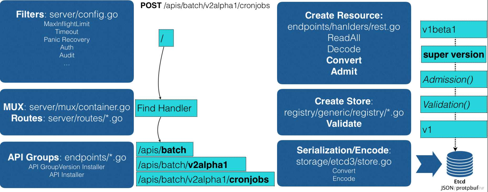
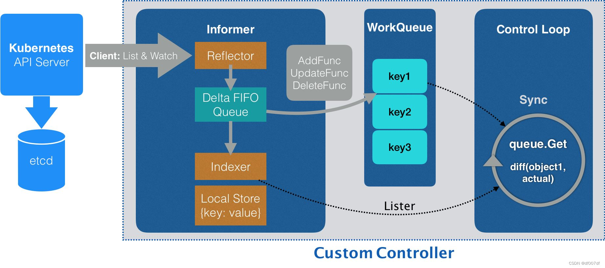
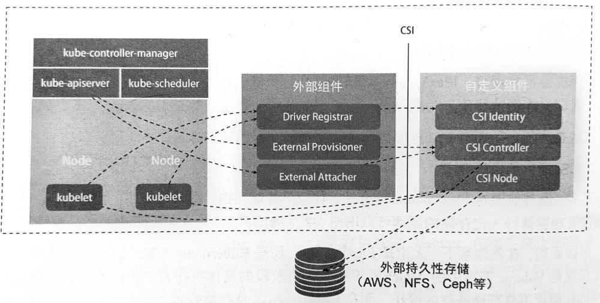
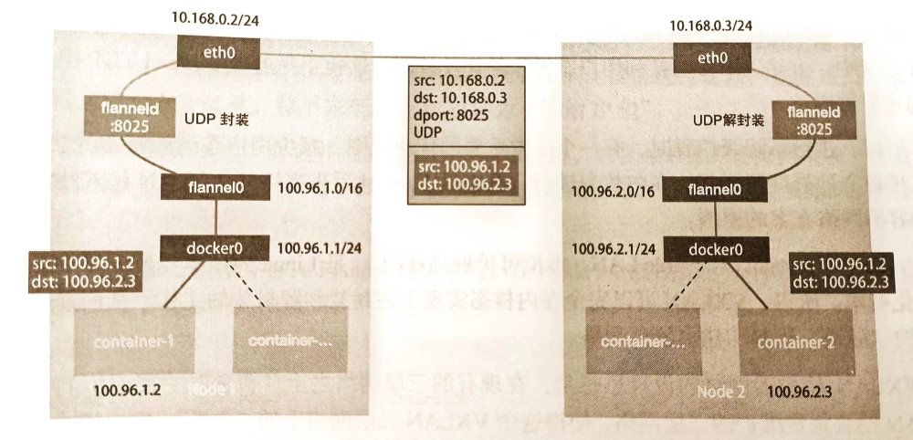
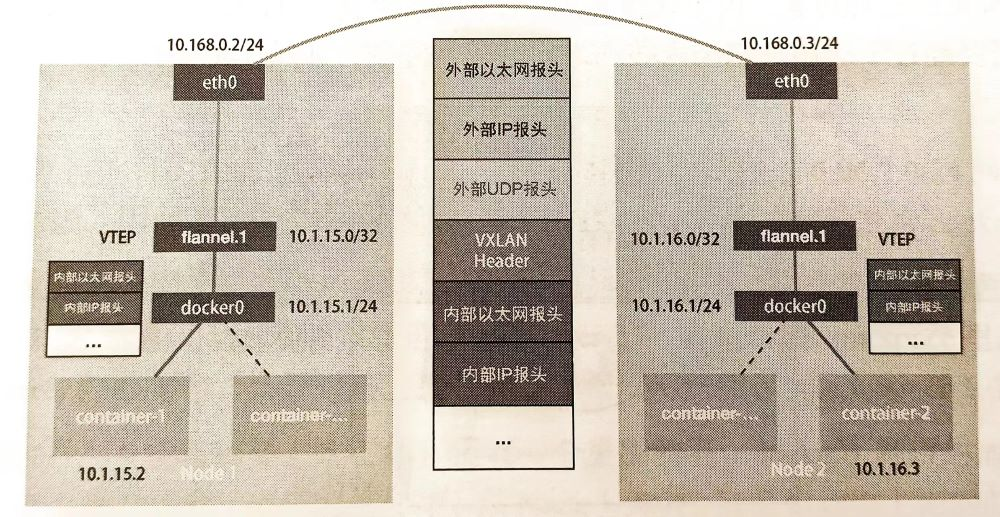
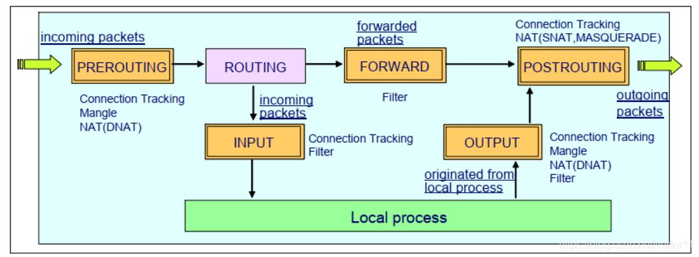
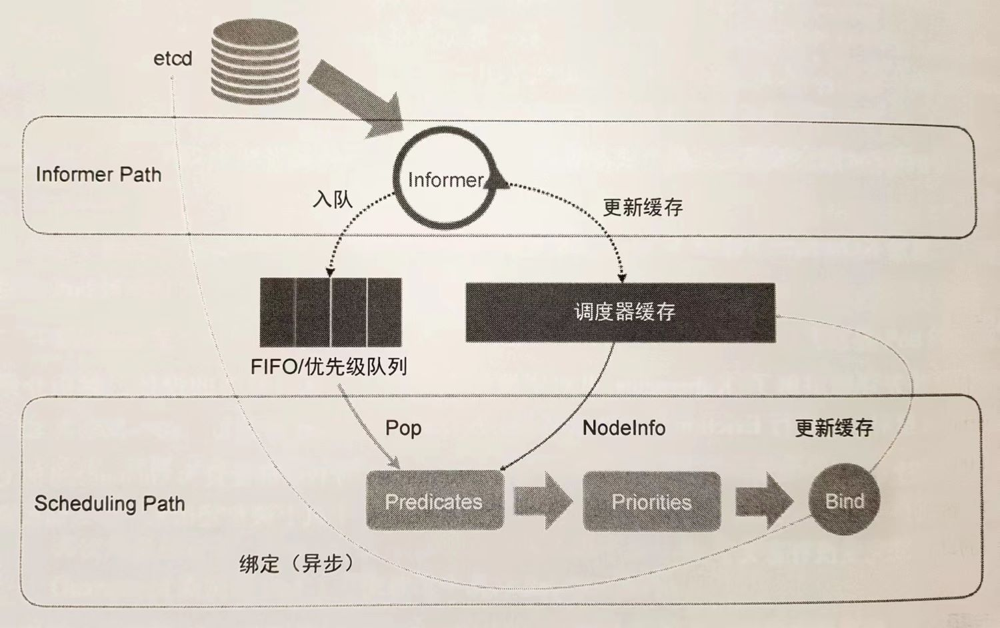
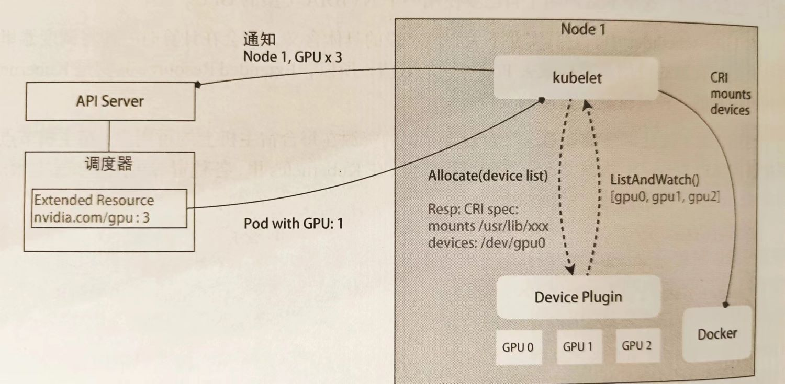

深入理解Kubernetes   张磊著

### 第一章 云原生大事记

- CloudFoundry公司开辟了PaaS(Platform as a Service)的市场，已有容器、沙箱等实现
- 来自于dotCloud公司Docker项目的发布颠覆了CloudFoundary复杂的打包流程，以image的概念将操作系统与文件目录打包到一起，从而可以快速地在任意机器部署环境
- Docker在短时间内吸引了大量开发者，出现了一批以Docker为核心的项目，一般自称为CaaS(Container as a service)。之后dotCloud更名为Docker公司，并开发了Swarm项目，试图回到PaaS(因为有更多的商业机会)
- 由于众多开发者不满意Docker公司越来越大的话语权，因此多方协同之下成立了`OCI`(Open Container Initiative)，意在将容器运行时和镜像的实现剥离出Docker，但效果不大。然后Google、Red Hat又牵头成立了`CNCF`(Cloud Native Computing Foundation)基金会，为Kubernetes的发展提供了良好条件：
  - Red Hat的众多开发者为项目提供了足够大的人力
  - Kubernetes在构建之初就在各层开放了众多插件接口，从而快速引入了一大批之后发挥重要作用的项目
- 试图将开源项目封闭与自己产品的Docker公司没能击败Kubernetes，最终进行了商业转型，并将容器运行时部分`Containerd`捐赠给CDCF。

### 第二章 容器技术基础

#### Namespace

启动一个容器，并执行`/bin/sh`

```shell
docker run -it busybox /bin/sh
```

可以发现在容器中，/bin/sh是PID为1的进程。Docker借助Linux的`Namespace`来进行**内核资源的隔离**，构建单独的进程空间，因此一个PID Namepsace中的进程在计算自己的PID号时只会在本空间下计算。

> 除了PID Namespace，还有Mount，UTS，IPC，Network，User等Namespace，从而实现对进程相关资源的隔离。实际上所有的计算和资源都是原来机器上的，根本不像虚拟机的Hypervisor还需要模拟一套硬件系统。

当然这种os**障眼法式**的隔离在提供了敏捷和便利的同时也带来了非常大的安全问题，例如一些危险的系统调用等等。

#### Cgroups

Docker借助Linux的`Cgroups`来**限制容器进程组可用的资源**，包括CPU、内存、磁盘、网络带宽等

Cgoups将资源限制以挂载文件的形式表示，一般在`/sys/fs/cgroup/xx`下，例如可以在`cpu`项下新建一个文件夹，在其中写入相关的配置，并将进程号写入对应`tasks`文件中。

这些资源限制在使用docker run命令时就可以指定，直接写入子系统文件中。

> Cgroups并未对`/proc`文件系统做限制，因此在容器中甚至可以读取其中文件查看宿主机的信息，这无疑是非常危险的。

#### File System

在进程被`clone`之初，所有的信息，例如文件目录都继承于父进程(即便是有Mount Namespace也是继承了父进程的)，因此需要对其进程**重挂载**的操作。Linux提供了`chroot`命令来对进程启动时的根目录进行重新挂载(Docker实际会使用功能类似的`pivot_root`)

```shell
chroot $new_path /bin/bash
```

而Mount Namespace就是根据chroot改进而来的。

所以一般来说，在容器启动时，会为其挂载一份完整的文件系统。但是操作系统的内核还是在机器启动时载入内存的，因此容器中的os文件**只有外壳，而没有灵魂**，实际上用的内核资源还是原来的。因此对内核的所有操作，实际上会影响所有共享这些资源的进程。

我们看到，一个容器实际上包含一整个rootfs，那么倘若需要对其做出少量有意义更改，是否需要另外打包出一份文件呢？实际上Docker利用`AuFS`(Advanced unionFS，在Linux UnionFS上改进的版本)来将不同的文件挂载到某个目录下，以实现**layer**的概念。增量更新只需要用挂载就可以实现不同版本的rootfs了！

实际实现时，Docker会将所有的增量联合挂载在`/var/lib/docker/aufs/mnt/<ID>`。

rootfs实际上分为多个层级

| 层       | 权限             | 内容                                                         |
| -------- | ---------------- | ------------------------------------------------------------ |
| 可读写层 | rw               | 可以增加文件或“删除”只读层的文件(增量式的遮挡)               |
| Init层   | ro+wh(write out) | Init容器时os中需要修改的一部分，例如`/ect/hosts`等，单独从只读层拿出来形成一层 |
| 只读层   | ro+wh            | 5层(5个文件夹)增量os文件                                     |

#### Linux容器实战

> 中国用户请为docker的deamon加上如下配置项实现换源：
>
> ```json
>  "registry-mirrors": [
>     "http://hub-mirror.c.163.com",
>     "https://docker.mirrors.ustc.edu.cn/"
>   ]
> ```

Dockerfile原语

| 原语               | 含义                                                         |
| ------------------ | ------------------------------------------------------------ |
| FROM ...           | 使用某个基础镜像                                             |
| ADD src dst        | 将**容器外**src目录下所有内容复制到**容器中**dst目录下       |
| WORKDIR ...        | 将工作目录切换到容器中的...目录，用RUN cd ... 无法起到相同效果 |
| RUN ...            | 执行一条shell命令                                            |
| EXPOSE ...         | 向外界暴露容器端口                                           |
| ENV ... ...        | 设置环境变量                                                 |
| CMD ["...", "..."] | 入口ENTRYPOINT的参数，默认ENTRYPOINT隐藏入口为`/bin/sh -c`。<br />可以将shell命令与参数放入列表，用于容器启动。如果没有CMD则需启动时指定要执行的进程。 |

- 规定好Dockerfile后，在目录下执行命令进行helloworld镜像的搭建

    ```shell
    docker build -t helloworld . 
    ```

- 用一个容器运行该镜像，并把本机5000端口映射到容器80端口

    ```shell
    docker run -p 5000:80 helloworld
    ```

- 在容器内运行指令(比如/bin/sh)

    ```shell
    docker exec -it ${container_id} /bin/sh
    ```

    Docker如何实现进入容器呢？(即怎么使一个新的进程加入某个namespace)？在容器进程对应的`/proc/${pid}/ns/...`有对应的ns文件，Linux提供`setns()`函数来打开一个ns文件并将当前进程加入对应Namespace。另外，也可以在run时指定`--net`来加入某个容器的net Namespace。

    ```shell
    docker run -it --net container:${container_id} ${image_name} ${cmd}
    ```

    当指定`--net=host`则会加入主机net Namespace。

- 将正在运行的容器打包更新某镜像

    ```shell'
    docker commit ${container_id} helloworld
    ```
    
    实际操作就是在可读写层进行写入和write out操作从而对镜像进行修改

#### Volume

docker可以利用volume将宿主机的目录挂载到容器中

```shell
docker run -v /test ... # 会在宿主机创建一个临时文件夹并挂载到容器/test
docker run -v ...:/test ... # 会将宿主机的...目录挂载到容器/test
```

上文讲过，虽然有Mount Namespace的存在，但是进程创建之初，文件系统的挂载与宿主机是一模一样的，因此在没有修改根目录之前，容器可以看到宿主机上所有文件和挂载，因此只需要在chroot之前使用Linux的`bind mount`机制将目录挂载即可(本质上就是指向同一个inode)，此时由于Mount Namespace的存在，宿主机并不会看到容器的挂载。

### 第三章 Kubernetes设计与架构


Kubernetes起源于谷歌技术栈最底层的`Brog`，从设计之初就借鉴了Brog的经验。master节点负责调度，node节点负责计算。在master节点上，有三个核心部件：负责API的`kube-apiserver`、负责调度的`kube-scheduler`以及负责容器编排的`kube-controller-manager`。计算节点上，核心功能就是`kubelet`，它能够通过`CRI`(容器运行时接口)进行对容器的远程调用。

以统一的方式抽象底层基础设施能力(计算、存储、网络)，定义任务编排的各种关系(亲密关系，访问关系、代理关系)，将这些抽象以声明式API的方式对外暴露，从而允许平台构建者基于这些抽象进一步**构建自己的PaaS乃至任何上层平台**。

Kubernetes将需要频繁交互的容器划分进一个`Pod`，这些容器共享Network Namespace以及Volume，能够高效地交换信息。同时定义出了

- Pod，Job，CronJob等任务编排对象，描述试图管理的应用
- Service，Ingress，Horizontal Pod Autoscalar等运维能力对象，进行具体的运维

实际使用时仅仅需要编写配置文件，这就是**声明式API**

### 第四章 Kunernetes集群搭建与配置

#### kubeadm

> 注：kubeadm在中国难以使用，推荐用kubeasz进行安装，详情请参考另一篇博客

诞生于2017年，解决kubernetes在部署时需要编译出每个组件以及进行繁琐配置的问题。

```shell
kubeadm init # 创建一个master节点
kubeadm join <master节点的IP和端口> # 加入一个node节点
```

为何不用容器部署kubernetes镜像呢？容器受限于Namespace创建的隔离景象，难以直接操作宿主机。

> 中国用户如何安装kubeadm？
>
> 环境：ubuntu 22.04
>
> - 添加阿里源
>
>   ```shell
>   echo "deb https://mirrors.aliyun.com/kubernetes/apt/ kubernetes-xenial main" | sudo tee /etc/apt/sources.list.d/kubernetes.list
>   ```
>
> - 尝试`sudo apt-get update `，如果出现`GPG error,... No public key ...`错误，将此处公钥内容填写到下方命令中
>
>   ```shell
>   sudo gpg --keyserver keyserver.ubuntu.com --recv ${public_key}
>   sudo gpg --export --armor ${public_key} | sudo apt-key add -
>   ```
>
> - 再次尝试`sudo apt-get update`，成功后`sudo apt-get install kubeadm`(包含了kubeadm, kubelet和kubectl)
>

kubeadm的工作流程

- `kubeadm init`

  - Preflight Check：检查内核等诸多依赖和资源是否可用
  - 生成各种证书(位于master节点的`/ect/kubernetes/pki`下，用于Https通信等)和目录
  - 生成其余组件访问kube-apiserver的配置文件(位于`/ect/kubernetes/xxx.conf`)
  - 为master组件生成Pod配置文件，以`Static Pod`的方式被部署(将配置文件放入特定目录`/ect/kubernetes/manifests`，当**kuberlet**启动时会加载并启动目录中的容器)
  - master容器启动后，kubeadm检查`localhost:6443/healthz`组件的健康来检查URL
  - 生成`booststrap token`供新节点加入集群

- `kubeadm join`

  - 为了和kube-apiserver进行交互，至少要进行一次不安全通信，此时为了自动化地建立可信连接，因此使用bootstrap token进行安全验证

    > kubeadm join是由用户发起的，因此是可信的

  - 第一次通信后拿到了安全证书等等，新节点上的kubelet就可以与apiserver进行安全交互了

使用`kubeadm init --config xx.yaml`以自定义各个组件的参数配置等

 #### k8s应用

一个描述需要部署的容器的yaml样例

```yaml
apiVersion: apps/v1
kind: Deployment #该API对象的类型是Deployment，可以管理多个Pod副本并滚动更新应用
metadata:
  name: nginx-deployment
spec:
  selector:
    matchLabels:
      app: nginx
  replicas: 2 #管理2个Pod副本，共3个Pod
  template:   #描述Pod副本的内容
    metadata:
      labels:
        app: nginx
    spec:
      containers: #Pod所包含的容器列表
      - name: nginx
        image: nginx:1.7.9 #容器所用的镜像
        ports:
        - containerPort: 80
      volumes: #Pod所包含的Volume列表
      - name: nginx-vol
        hostPath:
          path: /var/data #宿主机将被使用的目录，可以在Pod中使用volumeMounts来挂载，以及mountPath来指定挂载路径
```

可以通过`kubectl create -f 配置文件.yaml`进行API对象的创建，以及`kubectl replace -f 配置文件.yaml`进行API对象的更新。

推荐使用`kubectl apply -f 配置文件.yaml`统一处理

> 因此当应用发生变化时更新镜像即可，当编排发生变化时更新配置文件即可

使用`kubectl delete -f 配置文件.yaml`删除API对象

### 第五章 Kubernetes编排原理

#### 为什么需要Pod

预先建立**逻辑上**的“组”，然后成组地调度容器，这样可以避免资源不足带来的死锁或者回滚机制带来的复杂度。

所谓逻辑上的组，有两点

- 共享网络
- 共享Volume

这可以通过加入Namespace的方式来实现。

为了体现Pod内容器的**公平性**，每个Pod先建立一个**Infra容器**，然后让其他容器加入它。

可以说，**Pod就是Infra**，生命周期、网络都与Infra无异

一个使用Pod来组合war程序包与tomcat服务器的例子：

```yaml
apiVersion: v1
kind: Pod
metadata:
  name: javaweb
spec:
  initContainers: #整体执行上先于后面containers包含的容器，里面包含的容器按照先后顺序依次执行
  - image: geektime/sample:v2
    name: war
    command: ["cp", "/sample.war", "/app"] #将文件拷贝到app目录
    volumeMounts:
    - mountPath: /app
      name: app-volume #将app-volume挂载到app目录上
  containers:
  - image: geektime/tomcat:7.0
    name: tomcat
    command: ["sh", "-c", "/root/apache-tomcat-7.0.42-v2/bin/shart.sh"]
    volumeMounts:
    - mountPath: /root/apache-tomcat-7.0.42-v2/webapps
      name: app-volume #将app-volume挂载到webapps目录上，实现文件共享
    ports:
    - containerPort: 8080
      hostPort: 8081 
  volumes:
  - name: app-volume
    emptyDir: {} #用临时空文件夹初始化app-volume
```

#### 深入解析Pod对象

`spec`下一些重要的字段：

```yaml
spec:
  nodeSelector: #只会被调度到携带了这对键值对标签的node上去
    key: value
  nodeName: ... #默认由调度器来设置，如果设置了，调度时将会忽略该对象(y)
  hostAliases: #定义Pod的hosts文件的内容
  - ip: "...."
    hostnames:
    - "..."
    - "..."
  shareProcessNamespace: true/false #是否Pod间共享PID Namespace
  hostNetwork: true/false #是否共享主机网络
  hostIPC: true/false #是否共享主机IPC
  hostPID: true/false #是否共享主机PID
  containers: #定义包含的容器
  - name: ...
    imagePullPolocy: always #这是缺省值，可以改为never或ifNotPresent
    lifecycle: #定义容器状态变化时的hooks
      postStart: #容器被启动之后，但可能此时ENTRYPOINT还没有结束(异步)
        exec:
          command: [...]
      preStop: #一定在容器停止之前执行完毕(同步)
        ...
```

####  Pod对象使用进阶

**Projected Volume**：这种volume为容器提供预先定制的数据

- Secret

  可以帮你把Pod要访问的加密数据**存放到etcd中**

  创建Secret对象：

  - `kubectl create secret generic ${name} --from-file=${filename}`，将name对应的value放到filename中，这里的value是**明文**

  - 也可以使用yaml文件来创建

    ```yaml
    apiVersion: v1
    kind: Secret
    metadata:
      name: mysecret
    type: Opaque
    data:
      key: ${value} #这里是经过base64加密的密文
      ...
    ```

  通过`kubectl get secrets`直接看到所有的Secret对象

  使用Secret对象：

  ```yaml
  volumes:
  - name: ...
    projected: #类型不为emptyDir，也不为hostPath，而是projected
      sources:
      - secret:
        name: ${name} #刚刚创建的secret的名称
  ```

  最后在挂载点会有name对应的文件，文件内容为value，并且是与etcd一致实时更新的

- ConfigMap

  和secret类似，但是是明文内容

  创建ConfigMap对象：

  - `kubectl create configmap ${name} --from-file=${filename}`，文件中每行为key=value格式

  通过`kubectl get configmaps ${name} -o yaml`以yaml形式显示name的configmap

- DownwardAPI

  让Pod中的容器可以直接获取Pod的信息

  ```yaml
  volumes:
  - name: ...
    projected:
      sources:
      - downwardAPI:
        items:
        - path: ${path} #位于${挂载点}/${path}内
          fieldRef: #还可以使用resourceFieldRef
            fieldPath: ... #具体条目请参考官方文档
  ```

- ServiceAccountToken

  一个特殊的Secret。默认情况下，k8s为每一个Pod挂载了一个Secret Volume，存储Service Account Token用以操作k8s API本身，名字为**default-token-...**。service account是具有一定权限，例如get/write的账户

**restartPolocy**：当**容器**出现异常后，Pod会重新创建这个容器

> 只有Pod里的所有容器都出现异常以后，Pod才会出现异常，否则为Running，并在Ready字段显示可用容器数

定义路径在pod.spec.restartPolicy，可选值为Always【默认】/OnFailure/Never

例如一次性执行的容器Pod就没必要设为always

> 可以通过`kubectl describe pod ...`来查看Pod的信息，如果出现了fail&restart等情况，在event字段里会有记录

**PodPreset**：用于预置一些Pod的配置，方便直接再预定义上直接修改

```yaml
apiVersion: settings.k8s.io/v1alpha1
kind: PodPreset #PodPreset类型
metadata:
  name: allow-database
spec:
  selector:
    matchLabels:
      ${label}: ${value} #Preset要作用的Pod
  env: #定义一些环境变量
  - name: DB_PORT
    value: "6379"
  ...
```

使用方式：

```shell
kubectl create -f ${preset file}
kubectl create -f ${file} #label与preset的spec规定一致
```

当同时使用多个preset后，后面的会拓展前面的，但不会覆盖相同字段

#### “控制器”思想

控制器会执行一个循环，当发现相关Pod状态与预期不符时，会执行一些纠正操作。例如Deployment会按相关Pod的副本数是否为给定值，少则补充多则删除。其yaml文件大多为控制器定义+template的格式

#### 作业副本与水平拓展

Deployment实际上控制的是ReplicaSet这个API对象(由deployment自动生成)，由它继而控制下属的Pod。

想要水平拓展的话，可以通过`kubectl scale deployment ${name} --replicas=${num}`来修改Pod副本的个数

使用`kubectl edit deployment/${name}`可以修改etcd中配置文件【例如Pod中容器的定义】，之后自动进行滚动更新

> 背后的下载配置文件以及再次提交是自动完成的

更新时，会生成一个新的ReplicaSet，老的里kill一个Pod，新的里创建一个Pod，如此滚动更新

可以配置允许离线的Pod数，默认值为总数目(replica+1)的25%

```yaml
spec:
  replicas: 3
  strategy:
    type: RollingUpdate
    roolingUpdate:
      maxSurge: 1 #依次滚动更新可以创建的Pod数
      maxUnavaliable: 1 #(3+1)的25%
```

版本回滚：

- 回滚当然也会创建新的ReplicaSet，所以如果不希望有很多新的set出现，可以使用`kubectl rollout pause`来暂停动态更新，修改完之后再执行`kubectl rollout resume`来恢复，最终只会执行一次动态更新

  > 可以通过`spec.revisionHistoryLimit`来设置历史保留的ReplicaSet的数目

- 使用`kubectl rollout history`查看历史出现过的版本

  > 创建Deployment时加上--reocrd参数会记录导致版本变化的kubectl命令

- 使用`kubectl rollout history deployment/${name} --to-version=${version}`回滚到某一版本

#### 深入理解StatefulSet：拓扑状态

实例之间有**不对等关系**，实例对外部数据有**依赖关系**的应用称为**有状态应用**

Service是k8s将一组Pod暴露给外界的一种方式，主要有这样几种

- VIP(virtual IP)的方式，访问ip后请求被转发到service的Pod
- DNS方式
  - 解析为VIP
  - 解析为Pod的IP

Headless Service：没有VIP头的Service

```yaml
apiVersion: v1
kind: Service
metadata:
  name: nginx
  labels:
    app: nginx
spec:
  ports:
  - port: 80
    name: web
  clusterIP: None #没有定义VIP
  selector:
    app: nginx #Service为有这个label的Pod做代理
```

然后所有被代理的Pod将会被绑定到DNS记录`${pod-name}.${service-name}.${namespace}.svc.cluster.local`上【有时后面的cluster.local等等会被省略】

一个StatefulSet使用Service的例子，可以看到与deployment非常相似

```yaml
apiVersion: v1
kind: StatefulSet
metadata:
  name: web
spec:
  serviceName: "nginx"
  replicas: 2
  selector:
    matchLabels:
      app: nginx
  template:
    ...
```

StatefulSet会为这些Pod分配编号，并且Pod的网络身份(hostname等)也与编号严格对应

> 所以Pod有更新后，IP可能会变，但是DNS记录不会变。有状态应用都应该使用DNS记录或者hostname

#### 深入理解StatefulSet：存储状态

将存储系统解耦合，分为接口和实现，一方面便于在不了解存储系统的情况下快速搭建集群应用，另一方面减少存储系统关键信息的暴露。

接口部分，使用PVC(Persistent Volume Claim)，描述需要的Volume的特征

```yaml
apiVersion: v1
kind: PersistentVokumeClaim
metadata:
  name: pv-pod
spec:
  accessMode:
  - ReadWriteOnce #可读写权限，只能被挂载在一个节点上
  resources:
    requests:
      storage: 1Gi #Volume大小至少为1GiB
```

实现部分，使用PV(Persistent Volume)

```yaml
apiVersion: v1
kind: PersistentVolume
metadata:
  name: pv-volume
  labels:
    type: local
spec:
  capacity: 10Gi
  ... #具体的存储系统的信息，例如服务器地址，授权文件等等
```

使用样例：

```yaml
volumes:
- name: ... #自己起的，与上面volumeMount对应
  persistentVolumeClaim:
    claimName: pv-claim
```

k8s为根据声明自动查找满足条件的PV进行挂载。

StatefulSet也可以定义PVC的template，从而为每个Pod配一个PVC【使用时也是Pod使用对应PVC】

```yaml
spec:
  template:
    containers:
    - name: nginx
      volumeMounts:
      - name: www
        mountPath: ...
  volumeClaimTemplates:
  - metadata:
      name: www
    spec:
      ...
```

此时如果Pod异常挂了，新起起来的Pod依然会继承之前Pod的PVC，而那个PVC对应的PV也是之前的，所以存储内容会原原本本地继承下来

#### 容器化守护进程：DaemonSet

每个节点上运行且只运行一个DeamonPod，Pod的生命周期与节点保持同步

```yaml
apiVersion: app/v1
kind: DaemonSet
metadata:
  name: ...
  namespace: ...
  labels:
  ...
spec:
  selector:
    matchLabels:
      name: aaa
  template: #定义Pod的内容
    metadata:
      labels:
        name: aaa
    spec:
      tolerations:
      - key: node-role.kubernetes.io/master
        effect: NoSchedule
      containers:
      ...
```

DaemonSet的API和Deployment很像，但是没有**replicas**字段，使用`selector`来管理携带指定label的Pod。

为了在**指定节点**上创建Pod(在其上删除很好做)，DaemonSet会自动在**创建Pod时**根据节点名字加上`nodeAffinity`属性(nodeSelector的进阶)，下面是一个单独使用nodeAffinity的样例

```yaml
kine: Pod
spec:
  affinity:
    nodeAffinity:
      requiredDuringSchedulingIgnoredDuringExecution: #在每次调度时考虑该affinity
        nodeSelectorTerms:
        - matchExpressions:
          - key: metadata.name
            operator: in #操作符为部分匹配
            values:
            - bbb #用key来匹配这个value
```

另外，DaemonSet也会为Pod加上指定的tolerations关键字来**容忍**带有`network-unavaliable`污点的节点，例如

```yaml
spec:
  tolerations:
  - key: node.kubernetes.io/unschedulable #有unschedulable污点
    operator: Exists
    effect: NoSchedule #调度规则，还有NoExecute等
```

例如对于网络插件来说，在节点还没有被纳入网络时，仍然需要在该节点上建立用于控制的Pod，此时就需要容忍network-unavaliable的污点。

对于Deployment来说，其通过ReplicaSet来进行版本控制，而只有一个Pod的DaemonSet则通过`ControllerRevision`对象来进行版本控制。可以通过`kubectl get controllerVision`来看。实际上ContorllerRevision就是在其Data段记录了该版本的template。可以通过`kubectl rollout undo daemonset ${name} --to--revision=${version} rolled back`。

回滚实际上做的是patch更新，一个新的ControllerRevision会被创建出来(版本号+1)。

#### 撬动离线业务：Job与CronJob

离线业务：也称为**Batch** Job(计算任务)，需要在计算结束以后自然退出。

```yaml
apiVersion: batch/v1
kind: Job
metadata:
  name: ...
spec:
  template:
    spec:
      containers:
      - name: ...
        image: ...
        command: ["sh", "-c", "..."]
      restartPolicy: Never
  backOffLimit: 4 #失败重启的最大次数
  activeDeadlineSeconds: 110 #运行时间不超过110秒
```

通过describe可以看到Job对象的Pod模板被加上了一个controller-uid=${随机字符串}的Label，而Job本身则有了一个该label的selector

Completed不会重启，Failed会重启。

也可以定义并行任务

```yaml
spec:
  template:
    spec:
      parallelism: 2 #最大并行数(同一时间有多少Pod可以同时运行，默认为1)
      completions: 4 #最小完成度(至少要完成的Pod数目)
```

常用的使用方法：

- 制定Job模板(在name部分使用变量)，然后使用外部管理器来指定变量从而创建Job

  ```yaml
  # job-template.yaml
  metadata:
    name: ...$VAR
    labels:
      ...
  spec:
    ...
  ```

  ```shell
  for i in a b c
  do
    cat job-tempate.yaml | sed "s/\$VAR/$i" > ./jobs/job-$i.yaml #用sed命令将$var替换为这里的i
  done
  kubectl create -f ./jobs #将文件夹内的yaml全部创建出来
  ```

- 使用工作队列(例如使用外部程序作为生产者)进行任务分发，Job在指定并发度下进行消费，这种一般在completions固定的情况下使用

- 有并行度，但没有completions。这种需要为每个Pod制定退出的条件

**CronJob**：Job的控制器，定时任务

```yaml
apiVersion: batch/v1beta1
kind: CronJob
metadata:
  name: ...
spec:
  schedule: "*/1 * * * *" #空格分隔的五个部分分别代表分钟 小时 日 月 星期，/表示每，*表示0，1表示1个单位。意思是每一分钟执行一次
  jobTemplate:
    spec:
      template:
        spec:
          ...
  concurrencyPolicy: Allow #Forbid跳过/Replace替换，表示上一次Job没结束，此次任务启动的策略
  startingDeadlineSeconds: ${interval} #interval秒内Job创建失败了100次，那么Job将不会再被创建
```

#### 声明式API与Kubernetes编程范式

想要通过修改本地配置文件来修改一个对象，有两种方式，先编辑配置文件，然后

- `kubectl replace -f ${filename}`：使用新的对象覆盖旧对象(命令式配置文件操作)

  > 对象之前是通过`kubectl create`创建出来的

- `kubectl apply -f ${filename}`：对原对象执行了一次patch操作

  > 对象之前是通过`kubectl apply`创建出来的

patch操作(可以理解为merge地写)可以让对象有多个**写**端，从而能够并发地(k8s，插件，用户都有可能)进行修改。

以`Dynamic Admission Control`(`Initializer`)为例，它可以动态地做到对象在被k8s处理之前进行一些初始化工作：

- 用configMap存储操作要用到的数据

- 先将一个编写好的initializer作为Pod

- 执行如下伪代码

  ```go
  for {
      pod := getLatestPod()
      if !initialized(pod) {
          cm = getConfigMap()
          newPod = Pod()
          change(newPod, cm)
          
          patchBytes = CreateTwoWayMergePatch(pod, newPod)
          client.Patch(patchBytes)
      }
  }
  ```

- 也可以自己配置操作对象的范围

  ```yaml
  apiVersion: admissionregisteration.k8s.io/v1alpha1
  kind: InitializerConfiguration
  metadata:
    name: ...
  initializer:
    - name: ... #名字至少需要包含两个.
      rules:
        - apiGroups:
            - "" #意思是Core API Group
          apiVersions:
            - v1
          resources:
            - pods
  ```

  之后新的Pod会附带上metadata.initializers.pending，内容包含initializer的名字

  > 所以initializer根绝pending判断Pod有没有被初始化，以及初始化完之后要清除这个标志

  > 当然也可以在Pod的metadata.annotations里著名initializer，例如
  >
  > ```yaml
  > metadata:
  >   annotations:
  >    "initializer.kubernetes.io/envoy": "true"
  >    ...
  > ```

#### 声明式API的工作原理

API对象在etcd中的完整路径由Group、Version和Resouce(API**资源类型**)三个部分组成，以树形结构组织，例如

```yaml
version: batch/v2alpha
kind: CronJob
```

中，`batch`是Group，`v2alpha`是version，`CronJob`是Resource。对于Pod等核心api，直接按照version写的那样从/api下面匹配即可(`/api/v1/pods`)，而对于其他非核心api，需要在/apis下面匹配(`/apis/batch/v2alpha/cronjobs`)

POST请求创建API对象流程：



1. 经过过滤器过滤POST请求，完成授权等前置工作
2. 经过MUX等，完成URL与Handler的绑定
3. 处理该Post请求Handler的查找API对象的类型定义
4. 将yaml文件**转换**为`Super Version`的对象(该API对象的所有版本的字段全集)，用来统一处理不同版本的yaml文件
5. Admission & Validation(合法api对象被存入registry)
6. 转换回原版本，序列化后存入etcd

CRD的创建这部分书上代码不全且版本落后，具体例子可参考[sample-controller](https://github.com/kubernetes/sample-controller)

> apiextensions.k8s.io/v1beata1 is deprecated in k8s v1.22.0 version.

#### API编程范式的具体原理



控制器通过`Informer`获取它关心的对象。`Informer`通过`Reflector`包与APIServer建立链接，获取并监听对象的(增量)变化【例如增减对象就是通过Indexer控制的】，将其放入队列中。同时也不断从队列中读取对象【通过go routine建立若干个无限循环的协程】，根据增量类型**修改informer的缓存**，调用对应handler【使用neutron去修改真正的集群内容】。

> Informer往往响应迅速，而控制循环则可能会比较慢，因此用工作队列可以解耦二者

#### 基于角色的权限控制：RBAC

Role-based access control

- Role：角色，定义一组对API对象的操作权限
- Subject：被作用者
- RoleBinding：二者的绑定关系

举例：

```yaml
kind: Role
apiVersion: rbac.authorization.k8s.io/v1
metadata:
  namespace: mynamespace #通过namespace(逻辑上的管理单位，API对象默认为default)来指定产生作用的范围
  name: example-role
rules:
- apiGroups: [""]
  resources: ["pods"]
  verbs: ["get", "watch", "list"] #还有create，update等等
  # 需要指定某几个对象的话，可以用resourceNames: ["...", "..."]
```

```yaml
kind: RoleBinding
apiVersion: rbac.authorization.k8s.io/v1
metadata:
  namespace: mynamespace
  name: example-rolebinding
subjects:
- kind: User #作用对象为User类型，即k8s的用户
  name: exampe-user
  apiGroup: rbac.authorization.k8s.io
roleRef: #要绑定的Role
  kind: Role
  name: example-role #绑定之前定义的example-role
  apiGroup: rbac.authorization.k8s.io
```

对于非Namespaced的对象，比如Node等等，可以使用ClusterRole和ClusterRoleBinding，在metadata中不需要有namespace项

k8s的内置用户对象为`ServiceAccount`，更多时候我们直接使用它就可以了，而不需要使用`User`

```yaml
apiversion: v1
kind: ServiceAccount
metadata:
  namespace: mynamespace
  name: example-sa
#----------------------------
kind: RoleBinding
apiVersion: rbac.authorization.k8s.io/v1
metadata:
  namespace: mynamespace
  name: example-rolebinding
subjects:
- kind: ServiceAccount
  name: exampe-sa
  namespace: mynamespace
roleRef:
  kind: Role
  name: example-role
  apiGroup: rbac.authorization.k8s.io
```

创建完SA之后，k8s会自动生成一个secret对象。之后可以在Pod的`spec`中指定`serviceAccountName`，k8s会将证书文件挂载到容器内（namespace下没有声明SA的，会创建一个拥有大部分权限的default SA，因此生产环境中可以为default SA规定**只读**权限）。

同样，SA也有用户组的概念。SA在k8s中对应用户的名字为`system:serviceaccount:${name}`，对应的用户组名字为`system:serviceaccounts:${namespace}`。因此可以

```yaml
subjects:
- kind: Group
  name: system:serviceaccounts:mynamespace #如果仅有system:serviceaccounts就是针对所有namespace
  apiGroup: rbac.authorization.k8s.io
```

四个内置ClusterRole：`cluster-admin`，`admin`，`edit`，`view`

#### 聪明的微创新：Operator工作原理解读

Operator可以利用k8s的**CRD**来描述想要部署的**有状态应用**，然后在自定义控制器中定义具体的部署和运维工作。

### Kubernetes存储原理

#### 持久化存储：PV和PVC的设计与实现原理

PV和PVC和“面向对象”的思想非常类似，PVC就是**接口**，而具体的PV则是**实现**

k8s内部的PersistentVolumeController会不断查看每个PVC是否处于Bound状态，并为未绑定的PVC遍历所有PV尝试绑定。

持久化Volume的目录**不会因为容器的删除而被清理**，也**不会跟宿主机绑定**，因此其实现往往依赖一个远程存储服务，例如NFS等等

> hostpath和emptyDir不具有这个特征，既可能被清理，也不能迁移到其他节点上

一般来说，k8s准备持久化目录PV的过程分为两个阶段

|                    | 远程块存储                           | 远程文件存储                     |
| ------------------ | ------------------------------------ | -------------------------------- |
| 阶段一(**Attach**) | 在宿主机上挂载磁盘                   | /                                |
| 阶段二(**Mount**)  | 将磁盘格式化后挂载到宿主机volume目录 | 将远程目录挂载到宿主机volume目录 |

> PV的路径为`/var/lib/kubelet/pods/${pod id}/volumes/kubernetes.io-${volume type}/${name}`

k8s也提供了可以自动创建PV的机制：`Dynamic Provisioning`(之前是`Static Provisioning`)，通过`StorageClass`来自动创建PV模板。

```yaml
apiVersion: storage.k8s.io/v1
kind: StorageClass
metadata:
  name: block-service
provisioner: kubernetes.io/gce-pd #要使用的存储插件，实际上PV是由存储插件生成的
parameters: #PV的相关属性
  type: pd-ssd
#-----------------------------------------------
apiVersion: v1
kind: PersistentVolumeClaim
metadata:
  name: claim1
spec:
  accessModes:
    - ReadWriteOnce
  storageClassName: block-service #由于StorageClass生成的PV也带有SC的name，所以让PVC和PV匹配是个容易的事情
  resources:
    requests:
      storage: 30Gi
```

StorageClass并不仅仅用于Dynamic Provisioning，因为直接声明PV时给其StorageName属性赋一个不存在的Class也是可以的，这样是Static Provisioning，只要后面PVC也带有相同的属性，那还是可以匹配的。

#### 深入理解本地持久化数据

LocalPV(本地的持久化存储)的难点

- 如何把本地磁盘抽象为PV？

  宿主机目录不应该作为PV，因为无法保证磁盘空间不被其他应用争用导致空间不足。PV需要的一定是一块**额外挂载**在宿主机上的磁盘或者块设备

  > Linux上可以使用`mount -t tmpfs ${device name} ${dir like /mnt/...}`来使用tmpfs临时挂载出一个磁盘设备

- 如何保证Pod被调度到正确的node上去？

  LocalPV强调local，那就一定和具体的node关联。因此调度Pod时需要知道这些信息

  ```yaml
  kind: PersistentVolume
  ...
  spec:
    ...
    storageClassName: local-storage
    local:
      path: /mnt/disks/vol1 #PV的路径
    nodeAffinity:
      required:
        nodeSelectorTerms:
        - matchExpressions:
          - key: kubernetes.io/hostname
            operator: In
            values:
            - node-1 #规定Pod一定要在node-1上
  ```

  ```yaml
  kind: storageClass
  apiVersion: storage.k8s.io/v1
  metadata:
    name: local-storage
  provisioner: kubernetes.io/no-provisioner #没有插件来生产PV
  volumeBindingMode: WaitForFirstConsumer #延迟绑定特性，等到某个使用该PVC的Pod出现在调度器以后再尝试与PV绑定，这样可以让调度器综合考虑所有调度要求
  ```

删除local PV的过程

1. 删除Pod
2. 宿主机移除该硬盘(例如`umount`)
3. 删除PVC
4. 删除PV

另外k8s也提供了**Static Provisioner**插件来帮助将`/mnt/disks/`下每一个挂载都创建一个PV对象

#### 开发自己的存储插件：FlexVolume与CSI

CSI的原理：



- `Driver Registar`将插件注册到kubelet中，它需要请求`CSI Identity`的信息
- `External Provisioner`负责provision，它监听PVC对象的创建，并调用`CSI Controller`的CreateVolume方法创建PV
- `External Attacher`负责attach，它监听VolumeAttachment(确认volume可以进入attach阶段的标志)的变化
- Mount时直接调用`CSI Node`完成，不需要外部组件

> 实际使用时将三个外部组件和CSI放在同一个Pod中

### Kubernetes网络原理

#### 单机容器网络的实现原理

容器看见的网络栈(包括网卡，回环设备，路由表和iptables规则)隔离在它自己的Network Namespace中。容器的默认网关是docker0，所以外部的网络请求会经过docker0送往宿主机，对于处于同一网段的IP，容器的网关是0.0.0.0(即直连)，此时通过MAC寻址来通信。

有关docker0网桥的更多内容见本站另一篇博客：Docker网络虚拟化

#### 深入解析容器跨主机网络

Flannel的三种后端实现

- UDP，性能最差，已被弃用

  每个宿主机和其容器构成一个**子网**，每个节点有一个fannel0的TUN(tunnel)设备，它可以在内核和用户应用程序fanneld之间传递IP包。因此数据流为容器->docker0->flanneld->eth0->...(对称)。从flanneld到宿主机的过程中使用UDP封装，并且flannel通过检测目标容器的IP得到目标宿主机的IP，从而达到网络连接的目的。

  

  > 用户态容器->内核态docker0->用户态flanneld->内核态eth0，一次发包经历三次不同态之间的复制，消耗很大

- VXLAN(virtual extensible LAN)，Linux内核支持的网络虚拟化技术

  在传统三层网络之上覆盖二层网络，以VTEP设备作为隧道的两端，VTEP具有独立的IP和MAC

  

  当一个新的node加入集群后，flannel会为其他node加上发往该网段的包必须经由flannel.1设备发送的路由规则。VTEP收到原始IP报后，会用目的VTEP的MAC封装一个二层数据报，然后为了让Linux识别再加上一个VLAN Header，最后交给宿主机以UDP的形式发出去。由于宿主机的FDB转发数据库也是由flannel.1维护的，所以它也可以知道目的宿主机的IP。

  | 外部以太网头  | 外部IP头     | 外部UDP头 | VXLAN Header | 内部以太网头      | 目的容器地址 | $\cdots$ |
  | ------------- | ------------ | --------- | ------------ | ----------------- | ------------ | -------- |
  | 目的主机的MAC | 目的主机的IP | $\cdots$  | 一些标志位   | **目的VTEP**的MAC | 目的容器的IP | $\cdots$ |

- host-gw

#### Kubernetes网络模型与CNI网络插件

kubernetes用`CNI`接口维护了一个单独的cni网桥来替代docker0，名字叫cni0，node1路由表的规则

- 发往本网段内的包由cni0处理
- 发往集群外部某node网段的包由flannel.1设备处理
- 发往docker网段的包由docker0处理

CNI的设计思想就是Kubernetes在启动Infra容器之后能够直接调用CNI网络插件来配置网络栈

CNI插件分为如下几类(`kubeasz`安装的话都在`/opt/kube/bin/`中)：

- Main插件，用于创建具体网络设备，例如bridge、ipvlan等
- IPAM插件，ip address management，例如dhcp、host-local
- 内置插件，例如flannel

Pod网络构建流程：

1. flanneld在每台宿主机上生成CNI配置文件
2. kubelet主干代码不负责容器网络，而是交由CRI(Container Runtime Interface)进行，docker的CRI是dockershim，它来加载上述配置文件
3. dockershim调用Docker API创建Infra容器，然后调用CNI插件配置网络。参数第一部分来自dockershim主动设置的环境变量，包括容器里网卡的名字(rth0)，Pod Namespace文件的路径，以及`CNI_ARGS`这一自定义参数等；第二部分来自CNI配置。
4. flannel的CNI配置中`delegate`字段表明这个插件实际工作的交付者。因此Flannel CNI插件的作用就是简单地在delegate中补充一些配置信息，同时保存在`/var/lib/cni/flannel`下
5. 创建cni0网桥(如果没有的话)，进入network namespace创建veth pair设备，将这端的名字设为参数中容器网卡的名字，将另一端归属于cni0网桥(可能要设置Hairpin Mode来允许同一个包从这个端口进来又出去，因此如果设置了容器的端口转发，容器内部访问宿主机哪个端口时实际上会回到容器里)

> 因此在k8s中，所有的容器之间都是可以“通”的，容器看到的ip与真实ip是一致的

#### 解读Kubernetes三层网络方案

即只使用原来的三层网络

- host-gw(host-gateway)

  给node1的路由表设置node2网段IP对应的**下一跳IP**为node2的IP并且通过eth0设备发送，由于设置了下一跳IP，此时数据链路层就会用下一跳IP查出的MAC地址封装数据包。到达node2后，发现目的IP为子网中容器的IP，此时交由cni0处理

  | 目的MAC    | 目的IP          |
  | ---------- | --------------- |
  | node2的MAC | node2中容器的IP |

  > 由于需要node1知道node2的MAC，因此host-gw要求集群之间是**二层可达的**
  >
  > 但也由此相比VXLAN**减少了性能损耗**

- Calico

  原理大致与host-gw相同，但是使用了`BGP`协议来在集群中分发路由信息。Calico项目由以下三个部分组成

  - CNI插件

  - Felix，负责在宿主机上插入路由规则的DaemonSet

  - BIRD，BGP客户端，负责在集群中分发路由信息

  另外Calico**不会在集群中创建任何的网桥设备**，而是直接为每个容器创建连到宿主机上的veth pair(由于没有网桥，因此宿主机路由规则里也要写明去本网段xx容器IP得经由xxveth设备)

  默认情况下Calico维护的网络遵循Node-toNode Mesh模式，$N^2$量级，因此推荐100以下用。大规模集群推荐使用Route Reflector模式，即指定若干节点来学习全局路由信息，其余节点仅跟这几个节点交换信息。

  开启`IPIP`模式以后，Calico可以突破二层网络的限制。具体做法是将node1上到node2子网下一跳的eth0设备替换为tunl0设备(IP隧道设备)，然后在外面封装一层IP报头，伪装成node1到node2的IP包

  | 目的MAC           | 目的IP    | payload    |
  | ----------------- | --------- | ---------- |
  | 下一跳路由器的MAC | node2的IP | 原IP数据报 |

  不扩展host-gw给中间路由器也指定网段下一跳mac的原因是公有云环境下用户肯定不能随意更改服务器配置

#### Kubernetes中的网络隔离：NetworkPolicy

Calico、Weave均实现了NetworkPolicy，Flannel需要额外安装前述二者中一个

```yaml
apiVersion: networking.k8s.io/vl
kind: NetworkPolicy
metadata:
  name: test-network-policy
  namespace: default
spec:
  podselector: #如果设为{}，那就是对Namespace下所有Pod起作用
    matchLabels:
      role: db #所有携带了role=db的Pod
  policyTypes:
  - Ingress
  - Egress
  ingress: #流入白名单
  - from: #下方列表项间是“或”关系，列表项内才是与关系，因此可以在列表项内定义并列的(同一缩进层级)ipBlock和namespaceSelector规则
    - ipBlock: #源地址属于172.17.0.0/16且不属于172.17.1.0/24
        cidr: 172.17.0.0/16
        except:
        - 172.17.1.0/24
    - namespaceSelector:
        matchLabels:
          project: myproject
    - podSelector:
        matchLabels:
          role: frontend
    ports:
    - protocol: TCP
      port: 6379
  egress: #流出白名单
  - to:
    - ipBlock:
        cidr: 10.0.0.0/24
    ports:
    - protocal: TCP
      port: 5978
```

NetworkPolicy通过iptables规则来实现隔离，而iptables实际上操作的是Linux的Netfilter



#### 找到容器不容易：Service、DNS与服务发现

Service也通过iptables设置转发规则，通过对转发目的的概率设置，从而实现deployment下Pod的负载均衡

但是这样也造成大量Pod存在时，iptables不断更新带来性能的损耗，因此推荐开启kube-proxy的IPVS模式，大致就是搞一个虚拟网卡，把VIP分配给他以后设置多台虚拟主机，每台直接代理一个Pod，然后它们以轮询规则作为负载均衡策略。因为IPVS在内核态，所以无需频繁切换到内核态维护iptables。

| 对象                                                 | DNS记录                                                      |
| ---------------------------------------------------- | ------------------------------------------------------------ |
| ClusterIP模式的Service                               | `${service-name}.${namespace}.svc.cluster.local`             |
| ClusterIP=None模式的Headless Service                 | 同上，但返回的是所有被代理的Pod的IP地址的集合                |
| ClusterIP模式Service代理的Pod                        | `${pod-name}.${service-name}.${namespace}.svc.cluster.local` |
| Headless Service代理的声明了hostname和subdomain的Pod | `${hostname}.${subdomain}.${namespace}.svc.cluster.local`    |

#### 从外界连通Service与Service调试“三板斧”

由于Service依赖宿主机上kube-proxy生成的iptables规则和DNS记录，因此离开集群后这些信息是无用的。

从外部访问Service主要有如下方式：

- 使用NodePort

  ```yaml
  apiVersion: v1
  kind: Service
  metadata:
    ...
  spec:
    type: NodePort
    ports:
    - nodePort: 8080 #暴露给外部的端口
      port: 30080 #暴露在Cluster IP的端口，集群内部访问Service
      targetPort: 80 #代理的Pod的端口，实际访问Pod:这个端口
      protocol: TCP
      name: http
  ```

  Kuberetes会对离开宿主机的IP包(仅限于因为Service而被转发的，可以通过DNAT过程加上去的0x4000标志检测)做SNAT，将源IP换成自己的IP或者自己网桥的IP。这也很容易理解，例如client->node2，但是node2因为负载均衡把包转给了node1，此时如果node1收到的包src是client的话，那回复给client会造成client的收发不一致。因此需要node2给node1转发时把src IP换成自己的，组hi后再从自己这回client。

  如果需要明确知道具体是哪个Pod在负责处理请求，那这样是不行的，可以开启spec.externalTrafficPolicy=local，让请求只会被转发到自己node上的Pod。

- 使用LoadBalancer，适用于公有云服务

- 使用ExternalName，相当于在kube-dns添加了一条CNAME别名记录，访问xxx.cluster.local和访问externalName效果相同

  ```yaml
  apiVersion: v1
  kind: Service
  metadata:
    ...
  spec:
    type: ExternalName
    externalName: my.database.example.com
  ```

- 使用externalIP来代理Pod，这个IP得是你能够路由到的在集群中的一个节点

#### Kubernetes中的Ingress对象

Ingress相当于Service的"Service"

```yaml
apiVersion: networking.k8s.io/v1
kind: Ingress
metadata:
  ...
spec:
  tls:
  - hosts:
    - cafe.example.com
    secretName: cafe-secret
  rules:
  - host: cafe.example.com #必须是标准的域名格式字符串，不能是IP地址
    http:
      paths:
      - path: /tea #域名下不同的路径交给不同的service
        backend:
          serviceName: tea-svc
          servicePort: 80
      - path: /coffee
        backend:
          serviceName: coffee-svc
          servicePort: 80
```

可以使用Nginx Ingress Controller等等Ingress Controller来检测Ingress对象的创建，自动创建相关负载均衡服务，之后这可以用一个Service对外暴露这个服务即可。

> 使用到的yaml文件需要查阅相关controller提供的资料

### Kubernetes的资源模型与资源管理

#### Kubernetes的资源模型与资源管理

```yaml
kind: Pod
spec:
  containers:
  - name: db
    ...
    resources:
      requests:
        memory: "64Mi" #64MB内存，单位可以是Mi，M，Ki，K……
        cpu: "250m" #250millicpu，即0.25个CPU的计算能力，这里写0.25也可以
      limits:
        memory: "128Mi"
        cpu: "500m"
  - name: ...
  #最终Pod占用的资源是容器占用资源的总和，其中内存资源不可压缩，缺失会造成Out-Of-Memory从而被内核终止，CPU资源可压缩，缺失仅会造成一定程度的饥饿
```

`requests`是调度时使用的资源量，即Pod**一开始**会申请这么多资源以供调度，limits则是Cgroups中设立的最大资源量。当node不满足Pod的requests时，Pod会被调度到其他节点(失败重启)

若requests和limits中cpu的值为**相等的整数n**，那么会使其**绑定到n个cpu**上

> 类似于cpuset功能，减少cpu之间的上下文切换

Pod的三种QoS(Quality-Of-Service)级别：

- Guaranteed：每个容器都同时设置了requests和limits(只有limits时requests与其一致，因此也是该情况)
- Burstable：至少有一个容器设置了requests
- BestEffort：啥也没有

当整个kubernetes宿主机的资源发生不足，例如内存、文件系统可用空间低于阈值，会触发Eviction即资源回收，回收优先级依次为：

1. BestEffort
2. Burstable且对象处于饥饿且资源使用量超过requests
3. Guaranteed且资源使用量超过limits或宿主机memory pressure

> 因此建议将DaemonSet的Pod都设为Guaranteed类型，否则其被回收之后会立刻创建，从而造成回收的失效

#### Kubernetes的默认调度器



两个控制循环：

- Informer负责监听Pod的变化，更新调度器缓存以及维护优先队列

- 主循环

  - 从队列中Pop出Pod

  - 进行Predicate操作，选出潜在的node

  - 进行Priorities操作，对潜在node进行打分

  - Bind操作只更新缓存，称为Assume，乐观

    > 失败不要紧，同步操作最终会让现实与调度器缓存一致

  - 发起Goroutine联系API server发起异步请求

    > 实际Pod开始执行时，也会再跑一次Predicates进行二次确认

#### Kubernetes默认调度器调度策略解析

Predicates预选主要有四种

1. GeneralPredicates，简单地考察node的资源是否够Pod的requests

2. Volume相关

   - NoDiskConflict：多个Pod声明挂载的PV是否有冲突(不允许被共享之类)
   - MaxPDVolumeCountPredicate：检查一个节点上某个类型的PV是否超过了一定数目
   - VolumeZonePredicate：检查Zone标签(高可用域)是否匹配
   - VolumeBindingPredicate：nodeAffinity字段是否匹配

3. 宿主机相关，比如PodToleratesNodeTaints，只有污点被允许时才能调度，NodeMemoryPressurePredicate，内存是否足够

4. Pod相关，大多和general重合，另外有考察Pod和已有的Pod之间affinity(亲密度)和anti-affinity的关系

   ```yaml
   spec:
     affinity:
       podAntiAffinity: #反亲密度
         requiredDuringSchedulingIgnoredDuringExecution: #调度时必须考虑
         - weight: 100
           podAffinityTerm:
             labelSelector:
               matchExpressions: #不与携带有security=S2的Pod在一个节点上
               - key: security
                 operator: in
                 values:
                 - S2
             topologyKey: kubernetes.io/hostname #作用域为那些携带了kubernetes.io/hostname标签的节点
   ```

实际会并发16个Goroutine，为所有node计算shi否合适

Priorities优选策略

最常用的是LeastRequestedPriority(空闲资源最多)和BanlancedResourceAllocation(分配最平均)等

#### Kubernetes默认调度器的优先级和抢占机制

`PriorityClass`示例：

```yaml
apiVersion: scheduling.k8s.io/v1
kind: PriorityClass
metadata:
  name: high-priority
value: 1000000 #不大于1e9的整数
globalDefault: false #为true则成为系统默认值，false则只作用于这个PriorityClass
description: "..."
```

```yaml
kind: Pod
spec:
  ...
  priorityClassName: high-priority
```

这个value就体现在默认调度器的优先队列中

当高优先级Pod调度失败时，发生抢占事件。此时并不会立刻抢占，而是将抢占者的`spec.nominatedNodeName`设为将被抢占的节点名字，等到被抢占者_优雅退出_以后才被调度。在此期间给更高优先级抢占者的到来留下了充足的时间。

抢占算法使用了两个队列

- activeQ：下一个调度周期需要调度的对象

  > Pop出队发生在这个队列中

- unschedulableQ：调度失败的对象

  > unschedulableQ中Pod更新以后，会被挪到activeQ中重新**给予机会**

抢占流程：

1. 检查调度失败原因，**确认抢占可以找到新节点**

2. 复制一份缓存中的节点信息，用副本来模拟找出最佳结果，得出牺牲者列表

   1. 清理牺牲者列表中的`nominatedNodeName`

   2. 设置抢占者的`nominatedNodeName` > 进入activeQ

      > 如果其优先级很低，那可能还不如普通高优先级Pod

   3. 向API server逐一删除牺牲者

由于有抢占者的存在，因此一对Pod和节点之间进行预选时其实要运行两次预选算法，第一次是假设潜在抢占者在节点上运行(防止有InterPodAntiAffinity)，第二次假设不在，只有**两次都通过了**才会将Pod和节点视为可绑定

#### Kubernetes GPU管理与Device Plugin机制

```yaml
kind: Pod
spec:
  containers:
  - name: ...
    resources:
      limits:
        nvida.com/gpu: 1 #k8s并不在乎这个key的含义是什么，它只管计算value是否超出了容量
```

在kubernetes中，资源可用量来自于Node对象的`Status`

```yaml
apiVersion: v1
kind: Node
...
Status:
  Capacity:
    cpu: 2
    memory: 2049008Ki
```

因此可以用PATCH操作来增加自定义资源量的记录

实际上这样的工作可以交给Device Plugin来管理。



Device Plugin通过gRPC的方式与kubelet通信，ListAndWatch接口负责定时汇报GPU列表，Allocate接口负责分配一个可用GPU，返回设备路径和驱动路径。

