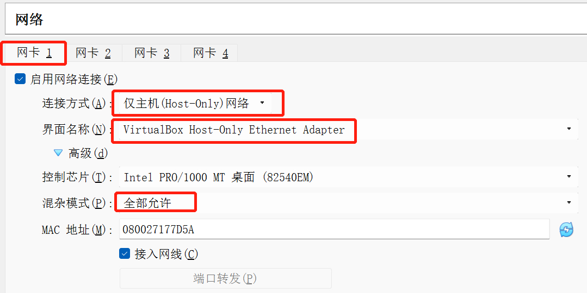
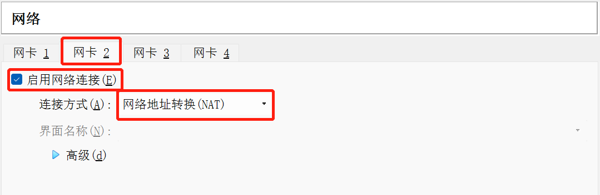
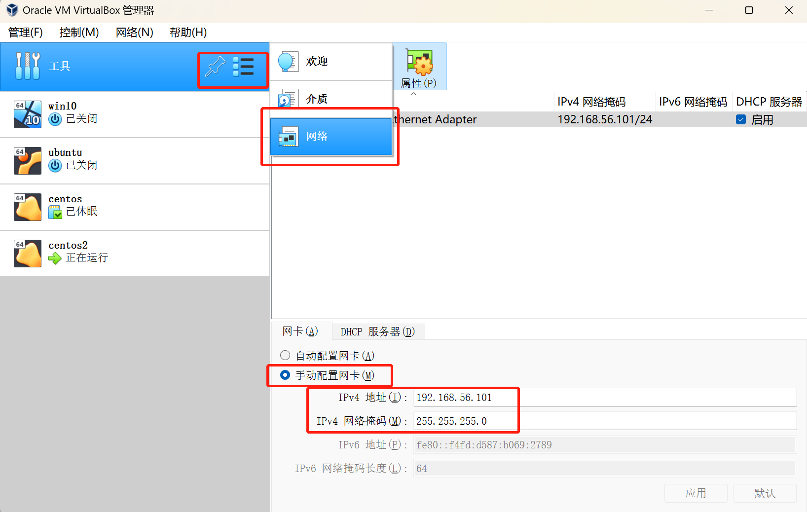
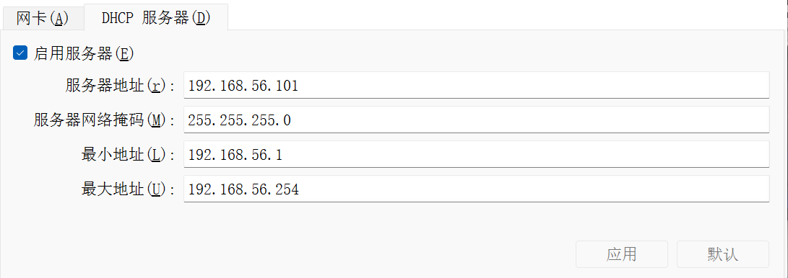
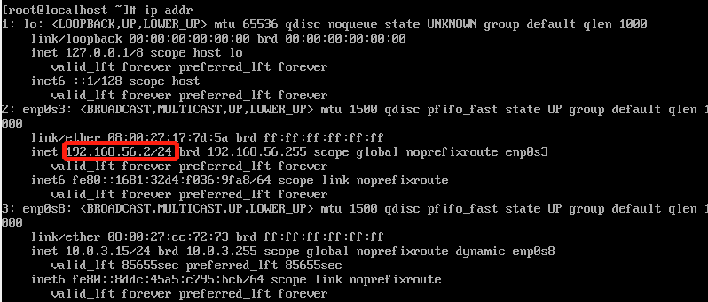
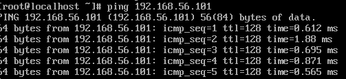
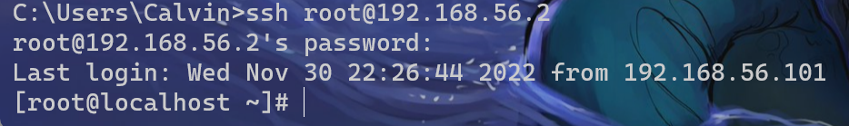

本文主要记录使用虚拟机搭建网络集群时的基本流程。所使用的环境为

- 宿主机：Win11，amd芯片
- 软件：VirtualBox 6.1
- 虚拟机镜像：Centos 7.9，下载源

#### 虚拟机网卡配置

配置两块网卡，一块Host-Only，一块NAT。





为Host-Only网络使用的适配器`VirtualBox Host-Only Ethernet Adapter`配置ip和子网掩码，以及DHCP服务器





同时可以在主机中使用`ipconfig`查看是否设置成功


#### 虚拟机网络设置

```shell
vi /etc/sysconfig/network-scripts/ifcfg-enp0s3
```

在文件中做如下修改，没有的话就加入【这步的目的是固定IP地址】

- BOOTPROTO=static
- ONBOOT=yes【可以把enp0s8也设为这个，这样开机也可以启动连接外网的网卡了】
- IPADDR=192.168.56.x【这里x为1~255，除了前面适配器和DHCP服务器的ip】

重启网络服务

```shell
systemctl restart network # 或service network restart
```

查看本机ip是否被修改为`192.168.56.x`

```shell
ip addr
```

可以看到ip已经被成功修改



尝试ping外界(之前设置的DHCP服务器)



从主机建立SSH连接



可以发现已经能连通主机和虚拟机

### 踩坑实录

若执行`ip addr`时发现NAT网卡没能拿到ip，可以通过`ifup NAT网卡名`来启动网卡服务。

例如负责连接外网的是`enp0s8`，只有mac地址而没有ip地址，说明该网卡没有启动，用`ifup enp0s8`启动网卡即可。
