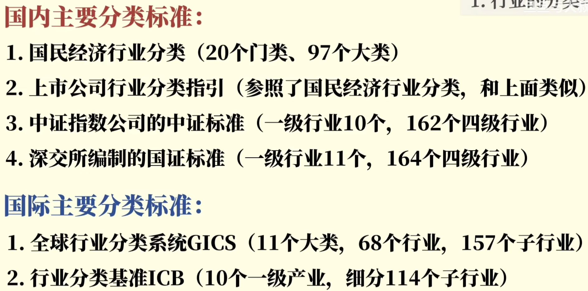
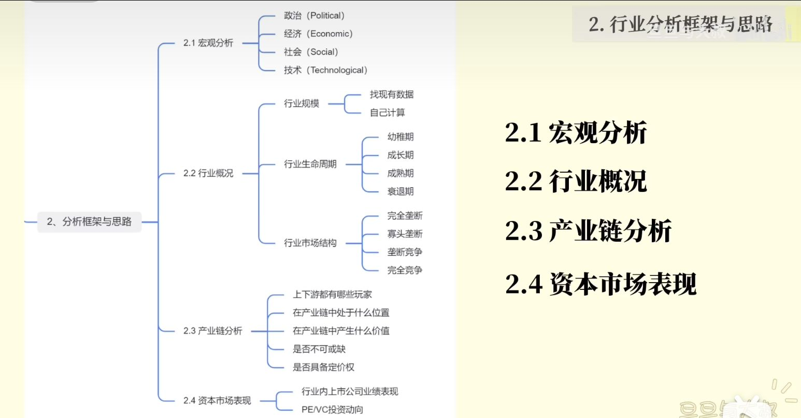
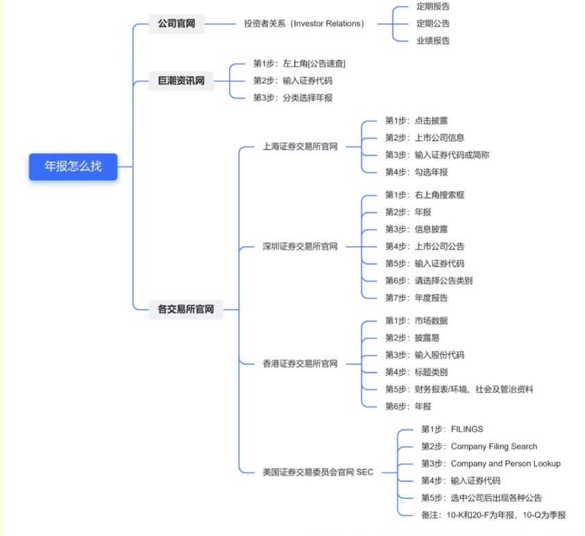
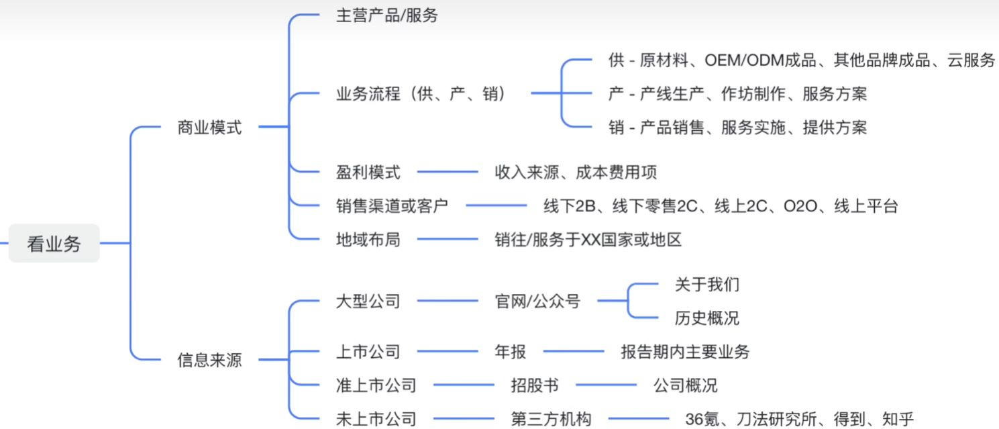
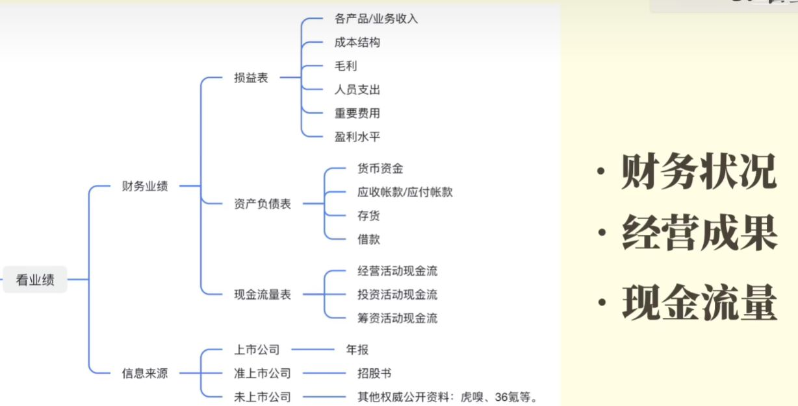
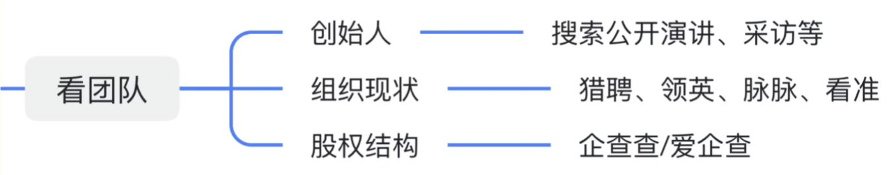

### 如何快速了解一个行业

参考资料：[如何快速了解一个行业｜5分钟方法论+资料库｜附思维导图\_哔哩哔哩\_bilibili](https://www.bilibili.com/video/BV1Vg411z7YN)

#### 如何界定行业

#### 行业分析框架

行业规模对公司的营收有一定参考价值，规模越大的行业，公司的营收一般会越高。行业生命周期则体现公司的发展前景。行业结构能够体现新玩家进入行业的难度，例如垄断行业对新人就很不友好。

行业的上下游业态、资本市场的表现往往预示着哪些行业是投资风口行业。

### 行业报告与数据怎么找

1. 行业报告

   - 各大咨询公司官网/公众号->行业关键词

   - 萝卜投研->研报->行业研究

   - 艾瑞网->行业关键词

   - IT桔子->报告库->桔子原创

   - 前瞻产业研究院->资源->报告

   - CBN Data->消费行业报告

   不过行业报告由于撰写者的原因也存在良莠不齐的情况，因此可以多关注客观数据资料

2. 年报和招股书

   - 看行业龙头公司的资料

     

   - **年报**中**市场回顾**部分可以帮助快速地了解过去一年市场的变化

   - **招股书**中**行业概览**模块会从市场规模、竞争格局、产业链等角度全面评述

3. 宏观数据

   - 国家统计局
   - 地方统计局
   - 工业和信息化部
   - 中国海关--进出口数据
   - 国家知识产权局

4. 关键词搜索

### 如何快速了解一家公司

参考资料：[如何快速了解一家公司｜6分钟方法论+资料库｜附思维导图\_哔哩哔哩\_bilibili](https://www.bilibili.com/video/BV1q84y1r7fE)

#### 看业务

即商业模式

业务流程：产品如何从无到有直到交付到用户手上

#### 看赛道

上市公司：二级市场-市值、市盈率

独角兽/小型企业：一级市场-融资热度、估值情况

以及之前分析行业等使用到的数据

#### 看业绩

#### 看团队

如果公司的股东中有一些行业龙头或PE/VC等，都会给公司一定的帮助

### 如何找一个好工作

#### 工作性价比

“具体思路是大行业里找小方向，比如chatgpt属于ai大行业里面的一个方向，这个方向之前没有挣钱最近挣钱了，这种从研究到产业化的过程就是前沿。具体寻找的过程需要你多做研究，多读文献。”

