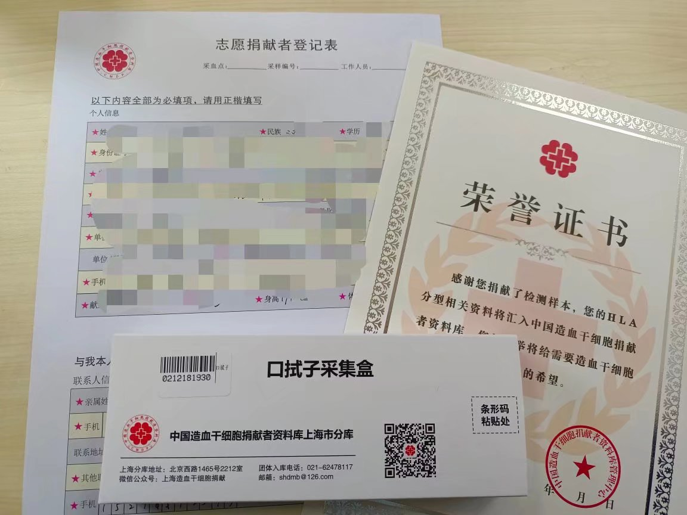

以下是我个人造血干细胞的捐献流程，记录下来以供参考

##### 2021年3月21日——入库报名

在朋友圈看到复旦红会的干细胞入库推送，现在捐献造血干细胞不需要进行骨髓穿刺而是进行外周血过滤的介绍极大地减少了我对捐献造血干细胞的恐惧。小学时学校组织为罹患白血病的同学募捐，自那时起我便模模糊糊地感觉血液病是一种类似“绝症”的东西。捐献造血干细胞能够挽救一个生命，我的父母也多次献血，况且这次活动只是简单地入个库，并不代表着一定要捐献，对我来说报名活动入个库是个很自然的事情。

##### 2021年4月6日——资料入库

活动在工会南204开展，期间遇到了一起上羽毛球课的医学院朋友，还是挺开心的。红会的老师给我们介绍了捐献造血干细胞的流程还有一些注意点等等。比如尽量留稳定可靠的联系方式，因为匹配到以后可能就是很多年以后了……

采集信息入库用的是口拭子，没有抽血。

当天下午感觉自己还算做了一件有意义的事情，想到可能未来十年八年后的一天突然接到一个配型成功的电话，不禁有些忐忑。从工会一路走到南区，时值暖春，生机勃勃，顺手拍下的一张照片刚好记下了我那时的心情。

##### 2022年10月31日——初配成功

接到电话的时候我刚到西辅楼准备去自习，电话里一个女声平静地跟我说：“您好，我是……这把显示您和一个白血病患者配型成功，请问您现在还有捐献的意愿吗……”听明白她的意思，那一瞬间很多种情绪一起向我涌来。多小的几率啊就给我给赶上了，我甚至没感觉到眼角突然的湿润——那是身体产生的应激反应。然后就是难以置信，说好的五六年七八年的呢，怎么我入库才一年半就配上了！再接着就是不安了，这通电话让“捐献”从一个不确定的幻影一下子变得沉甸甸的而有质量。我说，我和家里人再商量一下。

其实说商量也用不着商量，其实从我入库的时候我就已经知道，无论什么时候打电话给我，我的回答都是同意。做了决定以后，我便给家里人打了个电话，语气当然也很强硬，诸如这是告知云云——家人总归是要担心的，不过再怎么说他们也还是会遵从我的意见。

两点多的时候我回了个电话给中华骨髓库上海分库，表达了自己同意捐献的个人意愿。对方告诉我这边只是初配成功，之后还需要进行高分辨率检测，约好之后再聊。

当天看了一下午的相关报导，还有B站上别人拍的捐献造血干细胞的vlog。我刻意找了一些白血病患者的视频，想让我自己的意志坚定点。当然也看到了那个“临捐反悔典型案例”的视频，深感同意捐献就相当于背上了重重的责任。临捐之时，自己的手中也紧握着他人的生命。同时也有点担心自己初配成功高配失败——知乎上好像有好几个这样的案例，不过看到别人说最近几年技术进步，初配成功了高配也往往会成功，也稍微安了一点心。

##### 2022年11月3日——高分辨率检测

11月2日骨髓库通知我去做高分辨率检测，因为要报备出校也和辅导员简单聊了一下，在这里也感谢汪导的关心。

3日去了成都北路的爱心献血屋，同一直电话联系的石老师见了面，同时她也带过来一份高分辨率检测的知情同意书，我签字同意。之后去到二楼，一位护士姐姐给我采了两管血。

##### 2022年11月18日——全面体检

15日骨髓库告诉我高分辨检测通过了，和我约了周五体检。在市一院和学校附属的华山医院里我选择了近一点的市一院。18日早晨空腹前往市一院的国际医疗保健中心，在那里采血差不多有十管(其实也还好，没啥感觉)，做了影像检查等等，也没有花费太多时间。

12月16日我临走之前收到了寄过来的体检报告单，各项指标正常。

##### 2023年1月29日——约定捐献时间

接到骨髓库的电话，由于我是在校大学生，那边还需要我提供一份家长的知情同意书。家长说不上同意，但也并不反对，材料发给对方过后，初步约定在3月7日进行捐献。另外由于体检只有三个月有效期，因此在2月10日在进行一次体检。

##### 2023年3月3日——第一天

上午10点左右入院，下午4点出头打了一针动员剂，晚上9点左右打了第二针动员剂。我在入院之前有点感冒，当晚睡觉时感觉头部有点胀痛，然后背部也有酸胀感。

##### 2023年3月4日——第二天

早上6点左右抽血，然后打了一针动员剂，下午两点左右打了第二针动员剂。一整天都有点头晕脑胀，明显腰酸。

##### 2023年3月5日——第三天

打针，头晕，晚上睡觉有点头疼

##### 2023年3月6日——第四天

最后一天早晚针，晚上头疼，凌晨三点睡醒难以入睡，稍微坐了一会以后睡着

##### 2023年3月7日——第五天

早上6点打完针以后，9点左右机器基本就位。9点十五左右左右手臂打入留置针，不是很疼，机器启动。由于操作原因，到10点45左右猜排除了故障开始正常运转。中途手臂因为无法弯曲，肘部肌肉比较酸痛。到1点左右机器已采集200多毫升，可能软管出现破损，机器不停报错。医护人员计算得出干细胞浊液量基本已经足够，决定暂停分离。由于软管内有一点气泡，血液回流不是很安全，所以体外的几十毫升血液最终没有回流。

管子拔掉以后主要还是手臂比较酸痛，当天不可以洗澡。但是头痛症状当天明显消失。

##### 后记

之后基本就没有什么不适感了，和平时无异。医生和红会工作人员祝福回去要好好休息，一个月以内不要进行激烈的体育运动。这次经历对我来说也是非常难得的人生体验吧，自己也因此而有了更多的成就感。以后面对我的孩子，我可以骄傲地说：我也做过英雄。
